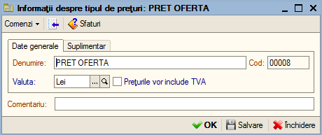
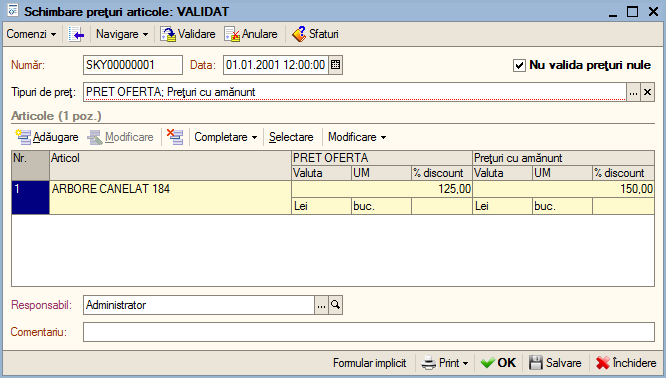
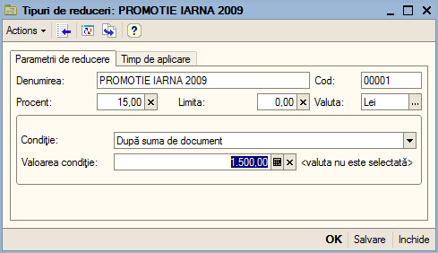

10. Catalog "Tipuri de prețuri"
===============================

În catalogul "**Tipuri de prețuri**" se adaugă tipurile de prețuri
pe baza cărora se creează listele de prețuri în program. Apoi
prețurile se definesc cu ajutorul documentului "**Schimbare preturi
articole**". Pentru a crea un nou tip de prețuri, accesați meniu
"**Prețuri și reduceri**", secțiunea cataloage și opțiunea "**Tipuri
de prețuri**". În continuare pentru adăugare unui tip de prețuri nou
vom utiliza una din comenzile standard și anume butonul
"**Adăugare**", combinația "**Alt+A**" sau tasta "**Insert**".

În fereastra deschisă veți completa "**Denumirea**", codul va fi generat
automat în momentul salvării datelor. În continuare veți selecta în ce
valută se vor ține prețurile, apoi dacă prețurile vor conține TVA veți
bifa opțiunea respectivă. Dacă doriți să configurați metoda de rotunjire
și veți trece la fila "**Suplimentar**".

|image115|

După ce ați introdus toate datele pentru finalizare veți apăsa "**OK**".

10.1. Document "Schimbare prețuri articole"
-------------------------------------------

Cu ajutorul acestui document se pot specifica prețuri predefinite pentru
articole. Documentul permite să introduceți pentru un singur articol mai
multe prețuri (liste de prețuri) într-un singur document. Acest document
este utilizat în special pentru gestiunile en-gros și care utilizează
prețuri de lista (ex. preț client; preț distribuitor; etc.)

Pentru a adăuga un document nou intrați in meniul "**Prețuri și
reduceri**", opțiunea "**Schimbare prețuri articole**", apoi accesați
butonul "**Adăugare**".

|image116|

Completați data documentului, apoi selectați lista de tipuri de
prețuri dorite prin apăsarea butonului "**…**". În funcție de
numărul de tipuri de prețuri selectate grila va conține tot atâtea
coloane de prețuri. Acum puteți trece la selectarea articolelor și
introducerea propriu-zisă a prețurilor. Articolele pot fi introduse
fie prin denumire fie automat cu ajutorul meniului "**Completare**".
După ce ați selectat articolul program va completa automat
"**Valuta**" și "**UM**", după care veți completa prețul.

După completarea prețurilor pentru toate produsele dorite veți
înregistra documentul cu butonul "**Validare**". Pentru listarea
prețurilor veți apăsa pe "**Formular implicit**".

10.2. Document "Schimbare prețuri parteneri"
--------------------------------------------

Operarea cu documentul de schimbare a prețurilor parteneri presupune
că se ține evidența listelor de prețuri primite de la furnizori
(exemplu: negociate în baza unui contract) . Ca urmare agenții vor
putea consulta prețurile de la furnizori și la introducerea facturii
de la furnizori va fi preluat nu ultimul preț ci prețul de listă
separat pentru fiecare furnizor. Acest document este foarte
asemănător cu documentul "**Schimbare prețuri articole**", de acea
nu vom insista cu explicațiile.

10.3. Document "Schimbare reduceri"
-----------------------------------

Cu ajutorul acestui document se pot specifica reduceri predefinite
pentru articole. Documentul permite să introduceți în funcție de mai
multe criterii reducerile pentru un articol sau chiar direct pentru
un grup de articole. Suplimentar documentul vă permite să
specificați o perioadă de valabilitate a reducerilor.

10.4. Catalog "Tipuri de reduceri"
----------------------------------

În acest catalog se definesc tipurile de reduceri pe baza cărora
apoi se creează documentul "**Schimbare reduceri**". Pentru a crea
un nou tip de reduceri intrați în modulul "**Prețuri și reduceri**",
în secțiunea cataloage, click pe opțiunea "**Tipuri de reduceri**".

|image117|

Apoi veți completa denumirea reducerii, procentul de reducere,
limita procentului acordat, valuta reducerii. În următorul câmp
trebuie să selectați condiția pe baza căreia se acordă reducerea.
Pentru a selecta veți face un click pe săgeata și selectați una din
opțiunile:

-  după suma document;

-  după tip de plată;

-  după cantitatea articol;

-  după discount card;

-  fără condiție (necondiționat);

-  reducere manuală.

După ce ați selectat condiția de acordare a reducerii veți specifica
valoarea reducerii la câmpul "**Valoarea condiției**", apoi dacă
doriți putem configura un interval de timp în care această reducere
va fi valabila. Odată ce ați terminat de introdus datele, pentru
salvare veți apăsa butonul "**OK**".

