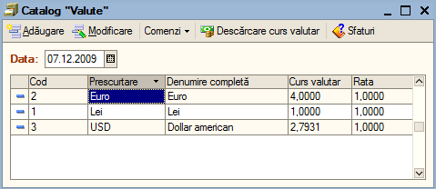

11. Operare în modulul "Casierie și banca"
==========================================

Modulul şi opţiunile din meniul "**Casierie și banca**" sunt utilizate
pentru introducerea a plăților și încasărilor fie efectuate prin
casierie sau bancă.

Principalele opţiuni ale modulului sunt:

-  catalog "**Valute**";

-  catalog "**Casierii**";

-  document "**Încasare**";

-  document "**Plată**";

-  document "**Compensare**";

-  raport "**Registru de casă**";

-  raport "**Mijloace bănești**".

11.1. Catalog "Valute"
----------------------

În acest catalog sunt definite lista de valute utilizate în program
și respectiv cursurile valutare aferente. Pentru a accesa catalogul
veți deschide meniu "**Casierie și banca**" și opțiunea "**Catalog
Valute**".

|image118|

În momentul în care se creează o bază de date nouă în catalogul de
valute vor fi adăugate implicit trei valute cele mai utilizate și anume:
**Lei** , **Dolar** şi **Euro**.

Înainte de a începe lucrul cu valutele trebuie să introduceți cursurile
valutare aferente. Aceste cursuri pot fi introduse atât manual cât și
automat. Pentru a introduce cursurile valutare manual veți deschide
pentru modificare valuta dorită și în fereastra deschisă în tabelul de
istoric cursuri valutare veți adăuga o înregistrare nouă și apoi
indicați data cursului și cursul în sine. Pentru preluarea automată a
cursurilor valutare veți apăsa butonul "**Descărcare cursuri
valutare**".

11.2. Catalog "Casierii"
------------------------

Catalogul va conține lista cu toate casieriile din cadrul societății
dumneavoastră. Pentru a deschide catalogul veți accesa meniul
"**Casieria și banca**" opțiunea "**Casierii**".

|image119|

Pentru a adăuga o nouă casierie apăsați butonul "**Adăugare**" sau tasta
"**Insert**" şi în fereastra apărută veţi specifica o denumire pentru
casieria dorită, apoi valuta şi în caz de necesitate puteţi specifica o
serie pentru chitanţele la încasare. Această serie va fi automat
preluată la crearea unei chitanţe de încasare. Pentru finalizare veţi
apăsa "**OK**".

|image120|

Înainte de a prezenta noutăţile introduse de această operaţie, să
încercăm deocamdată alegerea depozitului (gestiune), folosind pentru
aceasta butonul de selectare "**…**" care este ataşat la câmpul
respectiv.

11.3. Document "Compensare"
---------------------------

Acest document este utilizat pentru compensarea unor sume, fie între
parteneri, fie între documentele aceluiași partener. Pentru a accesa
documentul "**Compensare**" accesaţi modulul "**Casieria şi
banca**", apoi opţiunea "**Compensare**". În lista de documente
apăsaţi "**Adăugare**".

|image121|

În continuare veţi completa "**Data**", "**Seria RS**", "**Număr
RS**", apoi selectaţi partenerul fie prin inserarea numelui, fie
prin selectarea din listă prin click pe "**...**", apăsaţi butonul
"**Completare**". Ca rezultat programul ne va aduce toate
documentele neachitate către furnizorul respectiv, veţi şterge
documentele care nu fac obiectul compensării cu butonul
"**Ştergere**", modificaţi "**Suma compensată**" astfel încât
aceasta sa fie cu suma care se dorește a fi compensată.

În a doua grilă veţi selecta din nou partenerul, şi apăsarea butonul
"Completare" ne va aduce de data asta toate documentele care ne scad
soldul faţă de acest partener, documente neînchise în evidenţă, apoi
veţi şterge documentele care nu fac obiectul compensării cu butonul
"**Ştergere**", veţi modifica suma dacă va fi cazul, şi se apasă
butonul "**OK**" pentru salvarea datelor introduse.

***Atenție**! Suma compensat în debit trebuie să fie aceeași cu suma
compensată în credit aceste două sume nu sunt egale atunci nu veți putea
valida documentul "**Compensare**".

11.4. Raport "Registru de casă"
-------------------------------

Registru de casă este un raport ce evidenţiază plăţile şi încasările
zilnice efectuate cu numerar prin casieria societăţii. După ce aţi
deschis raportul veţi specifica intervalul raportului şi pentru
generare veţi apăsa "**Creare**".

|image122|

Dacă doriţi să generaţi raportul pentru o altă casierie diferită de
cea implicită, sau în valută apăsaţi butonul "**Configurare**".
Pentru a printa raportul veţi apăsa butonul "**Printare**" şi după
ce specificaţi imprimanta confirmaţi cu "**Print**".

11.5. Raport "Mijloace băneşti"
-------------------------------

Cu ajutorul raportului "**Mijloace băneşti**" se pot obţine situaţii
privind operaţiunile efectuate prin bancă (CEC, BO, Virament).
Pentru a deschide raportul veţi accesa meniu "**Casieria şi
banca**", opţiunea raport "**Mijloace băneşti**".

***Atenție!** Dacă observați o sumă eronată în registrul de casă,
vă poziționați cu un click pe încasare sau plata respectivă și
printr-un dublu click se va deschide exact documentul de plată sau
de încasare care a generat înregistrarea respective. Veți modifica
datele și apoi validați documentul din nou,după care reveniți la
registrul de casă și veți apăsa butonul de creare.

Pentru a genera raportul veţi specifica perioada de creare şi
apăsaţi butonul "**Creare**". Aveţi posibilitatea de a filtra şi
configura acest raport după mai multe criterii şi câmpuri, pentru a
accesa setările apăsaţi butonul "**Configurare**". Pentru a printa
raportul apăsaţi butonul "**Printare**"

Operare în modulul "**Societatea**"

Modulul şi opţiunile din meniul "**Societatea**" sunt utilizate pentru
introducerea datelor şi parametrii de evidenţă pentru societate
dumneavoastră.

Principalele opţiuni ale modulului sunt:

-  catalog "**Societăţi**";

-  procesare "**Parametri de evidenţă**";

-  procesare "**Politica de evidenţă**";

-  document "**Introducere solduri parteneri**";

-  document "**Planșă de numere (regim special)**";

-  raport "**Setare strategia de editare a numărului intern**";

-  catalog "**Utilizatori**".

.. |image119| image:: media/image120.png
   :width: 4.9375in
   :height: 1.92708in

