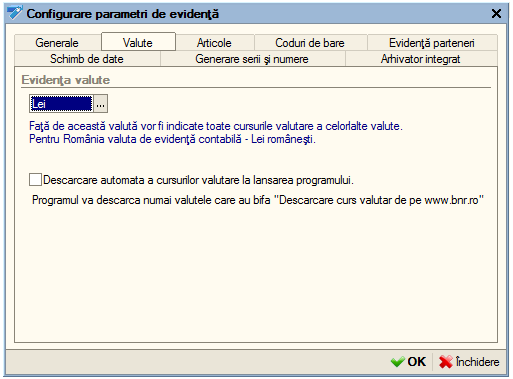

12. Catalog "Societăţi"
=======================

Acest catalog cuprinde informaţii şi datele generale despre societatea
d-voastră. Dacă n-aţi completat datele despre societatea la început (în
ghidul de pornire) atunci trebuie să modificaţi înregistrarea există.
Odată cu creare bazei de date programul automat adaugă o înregistrare în
acest catalog. Trebuie să modificaţi şi să adăugaţi restul datelor în
catalog.

Prin urmare veţi selecta înregistrarea introdusă deja cu un click şi
apoi veţi apăsa butonul "**Modificare**". Pentru a uşura introducerea
datelor iniţiale noi am creat o procedură care pe baza CUI-ului descarcă
în mod automat datele societăţii de pe
`www.mfinante.ro <http://www.mfinante.ro/>`__

|image123|

În continuare veți introduce conturile bancare, pentru această
accesați fila "**Conturi bancare**". Apăsați "**Adăugare**" apoi
introduceți contul IBAN, veți observa ca aveți posibilitatea să
verificați corectitudinea lui. În continuare veți selecta banca din
listă și indica sucursala băncii. Pentru finalizare apăsați
"**OK**".

|image124|

Acum vom trece la următoare filă și anume "**Informații de
contact**". Dacă ați preluat datele de pe `www.mfinante.ro
a <http://www.mfinante.ro/>`__ tunci cel mai probabil unele din
date vor fi deja completate și puteți trece la ultima filă. Dacă nu
aveți nimic introdus atunci cu un click veți selecta tipul
informației pe care o doriți să introduceți. Pentru preluarea
automată a adresei pe formularul de factură veți apăsa butonul
"**Implicit**" ca rezultat acea adresă va fi "bold-uită". În fila
"**Persoane responsabile**" veți introduce persoane responsabile
pentru societate.

12.1. Procesare "Parametri de evidență"
---------------------------------------

În această fereastră veţi completa și seta parametrii de evidenţă
pentru o utilizare mai optimă a programului. Pentru a accesa
procesarea veți deschide modulul "**Societatea**", opțiunea
"**Parametri de evidență**". Programul va prezenta prima filă
"**Generale**", unde va fi afișată versiunea curentă a programului
și veți putea specifica folder-ul pentru stocarea informațiilor
suplimentare.

|image125|

Să trecem la fila următoare "**Valute**", aici veți putea bifa opțiunea
"**Descărcare automată a cursurilor valutare la lansarea**
**programului**" ceea ce va permite odată cu lansarea programul să fie
preluate cursurile valutare de p `e www.bnr.ro <http://www.bnr.ro>`__

|image126|

În fila "**Articole**" puteți seta dacă doriți sau nu utilizarea
codurilor de bare de asemenea posibilitatea ca un singur cod de bare să
fie atribuit pentru mai multe articole. În cazul în care în societatea
urmează să se țină o evidență a articolelor după serii atunci veți bifa
opțiunea respectivă. Dacă se ține o evidență după coduri de bare atunci
veți trece la următoare filă "**Coduri de bare**" pentru a configura
restul setărilor legate de codurile de bare.

|image127|

În fila "**Evidență parteneri**" aveți posibilitatea de a configura
următoarele setări: programul să țină evidenţa decontărilor cu
partenerii pe bază de documente, la introducerea unui partener nou să
executați o căutare după CIF dacă a mai fost introdus sau nu și
posibilitatea de a nu înregistra în program decontările partenerilor.
Activare ultimei opțiuni va presupune că programul este utilizat la
nivel de program de gestiune.

|image128|

În fila "**Schimb de date**" veți opta pentru această opțiunea în cazul
în care programul a fost dispersat în mai multe baze de date și se
execută o centralizare a datelor. În fila "**Generării serii și
numere**" veți indica ce metodă doriți să utilizați pentru numerotarea
automată a facturilor şi chitanţelor.

|image129|

În final la fila "**Arhivator integrat**" veți specifica dacă doriți sau
nu utilizarea arhivatorului și unde trebuie să fie salvate arhivele.

12.2. Procesare "Politica de evidență"
--------------------------------------

În această procesare veți configura politica de evidenţă a
societății. Accesați modulul "**Societatea**", apoi opțiunea
"**Politica de evidență**". În lista apărută apăsați "**Adăugare**"
pentru a introduce o înregistrare.

|image130|

În fereastra apărută veți seta:

-  metoda de evaluare a stocurilor şi anume FIFO, LIFO sau CMP:

-  FIFO → articolele se scad de pe stoc în ordinea în care au fost
recepţionate după sistemul primul intrat primul ieşit;

-  LIFO → articolele se scad de pe stoc în ordinea inversă a
recepţionării după sistemul ultimul intrat primul ieşit.

-  CMP → articolele se scad de pe stoc pe baza costului mediu ponderat.

-  dacă societatea este plătitoare de TVA atunci veţi bifa opţiunea
respectivă.

***Atenție!** La definirea politicii de evidența trebuie să acordați o
atenție deosebită la perioada de valabilitate (câmpul "**Data**")
Perioada de valabilitate permite variația în timp a taxelor si
impozitelor ( în cazul nostru: metoda de evaluare stocuri și TVA), ceea
ce înseamnă că fiecare valoare este introdusă la o dată exactă și este
valabilă și pentru datele următoare , până nu se fac noi modificări în
politica de evidență. Valorile precedente sunt păstrate și pot fi
vizualizate .Dacă , ulterior introducerii datelor, apar modificări în
ceea ce privește politica de evidență a societății, puteți acționa și
modifica înregistrarea respectivă din meniul "**Societatea**" opțiunea
"**Politică de evidență**".

12.3. Document "Introducere solduri partener"
---------------------------------------------

Pentru introducerea soldurilor iniţiale ale partenerilor, veţi parcurge
următorii paşi: veţi accesa meniu "**Societatea**", opţiunea
"**Introducere solduri parteneri**". Acum sunteţi în faţa listei
''**Introducere solduri parteneri**'' în care veţi acţiona butonul
"**Adăugare**" sau tasta "**Insert**" şi se va deschide documentul
**''Introducere solduri parteneri: NOU''**, în care veţi acţiona din nou
"**Adăugare**" sau combinaţia "**Alt–A**" şi veţi introduce denumirea
partenerului pentru care introduceţi soldul, contractul, valoarea şi
veţi bifa, daca este cazul, dacă soldul a fost determinat pe baza unui
avans. Foarte important este câmpul ''**Data**'', pe care îl veţi
completa cu data la care a fost stabilit soldul pentru partenerul
respectiv.

|image131|

12.4. Catalog "Utilizatori"
---------------------------

La crearea unei baze de lucru noi o atenţie deosebită trebuie să
acordaţi creării şi configurării listei de utilizatori. La această
etapă, în afară de crearea utilizatorilor care vor lucra cu programul,
vom acorda drepturile de acces şi atribui interfeţele de lucru pentru
fiecare utilizator în parte.

Accesul în program, într-o anumită bază de date sau într-un anumit
catalog precum şi posibilitatea de a modifica, şterge sau adăuga date în
diferite documente ale programului este complet controlată de către
program pe baza drepturilor de acces şi interfeţelor de lucru.

Un utilizator cu drepturi de **Administrator** poate crea un număr
nelimitat de utilizatori şi dacă doreşte poate configura utilizatorii în
catalog după grupe. Astfel fiecărui utilizator în parte i se va atribui
anumite drepturi şi restricţii. Drepturile aferente unui utilizator se
încarcă în momentul în care acesta îşi introduce numele de logare şi
parola corespunzătoare la lansarea programului.

Următorul pas este de a introduce utilizatorii. Pentru aceasta vom
accesa catalogul de utilizatori din meniu "**Societatea –
Utilizatori**".

|image132|

Această pagină va permite să definiţi lista de utilizatori. Pentru
adăugarea unui utilizator nou puteţi utiliza butonul "**Adăugare**" din
bara de navigare sau combinaţia "**Alt-A**".

În fila "**Informaţii generale**" veţi configura informaţiile generale
pentru fiecare utilizator prin atribuirea unui nume (de exemplu
administrator, casier etc.) şi parole de intrare în program, veţi
specifica interfaţa de lucru şi selecta dreptul de acces.

|image133|

Se poate preciza faptul ca numele utilizatorului respectiv să se
regăsească în mod automat în lista de utilizatori la lansarea
programului, altfel dacă nu selectaţi bifa respectivă utilizatorul va
trebui să introducă manual numele. Dacă utilizatorul este responsabil de
emiterea facturilor fiscale atunci vă recomandăm să specificaţi
angajatul la câmpul "**Persoana fizică**" adică să selectaţi angajatul
căruia îi corespunde utilizatorul respectiv. Acest lucru va permite la
emiterea unei facturi să fie completate automat datele despre persoana
responsabilă (CNP, seria şi numărul buletinului de identitate etc.).
După ce am introdus datele generale despre utilizator putem trece la
următoare filă şi anume "**Setări**".

|image134|

Selectarea filei "**Setări**" va avea ca efect apariţia pe ecran a unei
structuri arborescente care va cuprinde casete de validare şi diverse
câmpuri ce va permite stabilirea unor valori implicite ce vor fi
preluate la crearea unor obiecte noi şi acordarea unor drepturi
speciale. Tot ca exemplu se poate preciza faptul ce Cotă de TVA va fi
atribuită automat produselor noi sau posibilitatea de a printa direct
formularele. După ce aţi configurat setările utilizatorului puteţi trece
la următoarea filă unde puteţi specifica datele de contact al
utilizatorului.

***Atenție!** Numai un utilizator cu drepturi de administrator poate
adăuga utilizatori noi și modifica datele oricărui alt utilizator
existent. Dacă un utilizator are drepturi de acces "**Operator**" atunci
el va putea configură numai setările personale.

Pentru a consulta lista utilizatorilor conectați online la program
puteţi accesa fereastra respectivă din meniu "**Unelte – Utilizatori
activi**". Pentru fiecare utilizator în parte vor fi afişate: Numele
utilizatorului conectat, sesiunea în care lucrează în acel moment,
data/ora la care a intrat şi calculatorul de pe care s-a conectat.

.. |image129| image:: media/image130.png
   :width: 5.25in
   :height: 3.88542in

.. |image132| image:: media/image133.png
   :width: 5.40625in
   :height: 2.30208in

