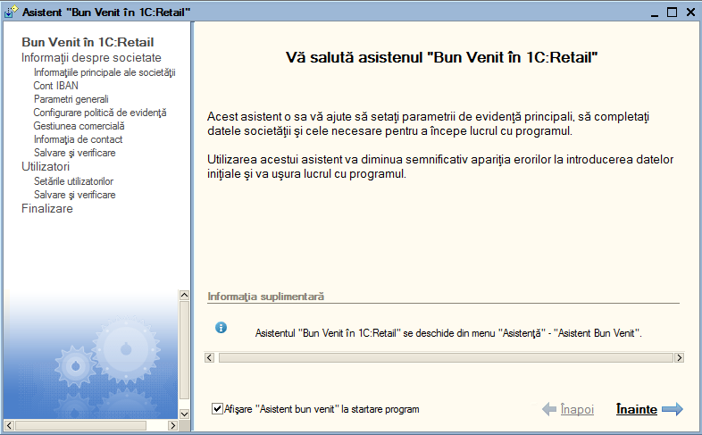
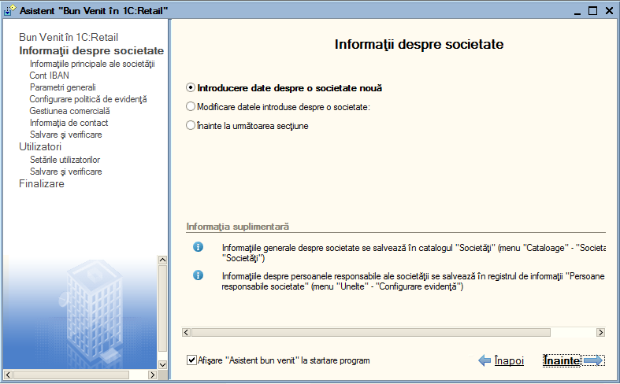
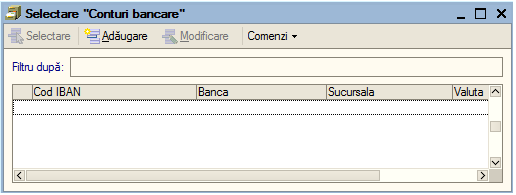
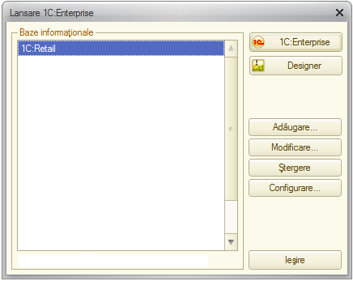

1. Introducere în 1C:Retail
===========================

**1C:Retail** este un sistem integrat complex și complet destinat nu,
numai vânzării ci poate fi utilizat și la următoarele activități din
cadrul unei firme, cum sunt: aprovizionarea, gestiunea, și înregistrarea
operațiunilor contabile primare. De asemenea, aplicația este concepută
să răspundă cerințelor managementului companiei prin furnizarea de
analize, statistici și rapoarte economico-financiare conform legislației
în vigoare.

Începând cu acest capitol vom descrie modalitatea de operare în
programul **1C:Retail** şi efectuarea unor operaţiuni ce vor avea drept
rezultat introducerea informaţiilor în decursul unei luni de exercițiu.

***Atenție!** Menţionăm încă de la început că modalităţile prezentate
nu exploatează toate facilităţile oferite de **1C:Retail**, având drept
scop doar familiarizarea cu facilităţile de bază.

Pentru a ajunge la o exploatare cât mai corectă și mai completă a
sistemului, este foarte important primul pas, şi anume introducerea
datelor de bază ale societății. Astfel, vom introduce împreună lista de
utilizatori, datele despre societatea nouă, politica de evidenţă, lista
de conturi bancare, lista depozitelor și vom configura gestiunea
comercială.

1.1. Înregistrarea informațiilor de bază ale societății. Ghidul de pornire ''Bun venit în 1C:Retail!"
-----------------------------------------------------------------------------------------------------

De la prima lansare **1C:Retail** vă permite să parcurgeţi o cale mai
dinamică pentru introducerea datelor de pornire, în sensul că va lansa
în execuţie **asistentul ''Bun venit in 1C:Retail''**. Acest ghid de
pornire îşi propune să vă ajute la refacerea traseului firesc de
introducere a datelor de pornire.

Prima pagină va conţine explicaţii generale privind acest ghid de
pornire. În partea stângă vor fi afişate toate paginile ce trebuie
parcurse pe parcursul acestui ghid de pornire. Pentru a trece la
următoarea pagină vom apăsa butonul **"Înainte"**, iar la sfârşitul unei
secţiuni vom acţiona **''Salvare şi verificare**'' pentru a salva
informaţiile introduse şi pentru a trece la următoarele secţiuni.

În cadrul paginii următoare avem posibilitatea: să optăm pentru
introducerea datelor pentru o societatea nouă sau dacă datele respective
au fost deja introduse şi doriţi să le modificaţi veţi selecta a doua
opţiune şi în cazul în care datele au fost introduse corect sări direct
la următoarea secţiune prin alegerea ultimei opţiuni.

|image1| Așadar, în urma apăsării butonului "**Înainte**" o să apară
fereastra de mai jos în care aveți trei posibilități: "**Introducere
date despre o societate nouă**", "**Modificarea datelor introduse despre
o societate**", "**Înainte la următoarea secțiune**".

Pentru a introduce datele despre societatea nouă selectăm prima variantă
și apăsăm butonul "**Înainte**".

|image2|

În următoarea fereastra vom crea societatea de lucru şi veţi proceda la
introducerea datelor acesteia (prescurtarea, tipul societății, denumirea
completă, codul de identificare fiscal (CIF), numărul de înregistrare la
Registrul Comerţului). Ulterior pentru a efectua modificări asupra
datelor societăţii, puteţi accesa înregistrarea în cauză din catalogul
de societăţi (catalogul este localizat astfel in meniu "***Societatea →
Societăţi***").

|image3|

După introducerea datelor trecem la următoarea etapă cu ajutorul
butonului "**Înainte**".

Următoarea fila este reprezentată de "**Cont bancar principal**".În
secțiunea "**Cont bancar**" apăsăm butonul selectare |image4|.

|image5|

Ca efect al apăsări acestui buton o să se deschidă lista cu conturi
bancare ca mai jos. Cu ajutorul butonului "**Adăugare**" creăm un nou
cont bancar.

|image6|

În fereastra "**Informații despre cont bancar**" pe fila "**Date
generale**", se completează contul IBAN, denumirea băncii și sucursala.

|image7|

Pe fila "**Suplimentar**" se alege "**Valuta**", "**Tipul de cont**".

|image8|

Apăsați butonul "**OK**" pentru salvare și închidere sau combinația de
taste "**Ctrl + Enter**".Se alege din nou contul bancar creat. Pentru a
trece la următoarea etapa apăsăm butonul "**Înainte**".

În cadrul acestei etape trebuie bifate anumite setări în funcție de
nevoile pe care fiecare firmă le are. Astfel va trebui să treceți pe
fiecare filă în parte și anume "**Articole**", "**Coduri de bare**",
"**Evidență parteneri**", "**Schimb de date**", "**Verificare număr și
serie**" pentru a face setările "**Parametrilor generali**".

Așadar, veţi completa parametrii de evidenţă: posibilitatea de a utiliza
coduri la articole sau a seriilor, utilizarea codurilor de bare,
evidenţa decontărilor cu partenerii pe bază de documente, utilizarea
schimbului de date şi metoda utilizată pentru numerotarea automată a
facturilor şi chitanţelor.

Pentru modificări ulterioare ale parametrilor de evidenţă, veţi putea
accesa înregistrarea respectivă din catalogul ''**Societăţi**'',
opţiunea ''**Parametrii de evidenţă**''.

Pentru a trece la următoarea secţiune, veţi apăsa butonul
''**Înainte**''**.**

|image9|

Configurarea politici de evidentă. În această fereastra se va configura
politica de evidență prin apăsarea tastei"**Insert**".|image10|

În această etapă este reprezentată de configurarea politicii de evidenţă
pentru societatea creată. În acest caz se vor seta: În acest caz se vor
seta următoarele:

-  metoda de evaluare stocuri: **FIFO** (First IN → First OUT), **LIFO**
(Last IN → First OUT) sau **CMP** (Cost Mediu Ponderat);

-  dacă societatea curentă este plătitoare de TVA atunci veţi bifa
căsuţa respectivă.

***Atenţie!** La definirea politicii de evidenţă trebuie să acordaţi o
atenţie deosebită la perioada de valabilitate (câmpul "**Data**").
Perioada de valabilitate permite variaţia în timp a taxelor şi
impozitelor (în cazul nostru: metoda de evaluare stocuri, plătitor de
impozit şi TVA, politica de TVA (emitere sau încasare), ceea ce înseamnă
că fiecare valoare este introdusă la o dată exactă şi este valabilă şi
pentru datele următoare, până nu se fac noi modificări în politica de
evidenţă. Valorile precedente sunt păstrate şi pot fi vizualizate.

Dacă ce aţi terminat de definit politica de evidenţă, atunci cu butonul
"**Înainte"** treceţi la următoarea pagină.

Acum vom defini lista de depozite (gestiuni) din cadrul societăţii.

|image11|

În lista de depozite veţi observa o poziţie deja introdusă. Poziţia
"**Depozit**" apare implicit, logica existenţei acestei poziţii este că
orice societate are măcar o gestiune (depozit). Dacă nu aveţi în firmă
nici un depozit căruia să i se potrivească această denumire, atunci
n-aveţi decât să modificaţi această înregistrare. Apăsaţi click pe
câmpul "**Denumire**".

Înlocuiţi acum denumirea depozitului "**Depozit**" cu "**Magazin**".
După cum vă aşteptaţi, denumirea s-a schimbat şi în lista de depozite.
Continuaţi cu alegerea valorii la câmpul "**Tipul de depozit**". Dacă
evidenţa gestiunii se ţine după metoda global-valorică se va bifa
opţiunea respectivă.

În cazul metodei global-valorice programul oferă posibilitatea să
introduceţi la cumpărare şi vânzare fiecărui articol din factură şi apoi
să listaţi după caz NIR-ul sau factura fiscală. Deşi veţi introduce mai
multe rânduri în grila documentului, programul va genera numai o
înregistrare pentru o gestiune global-valorică. Pentru a utiliza această
facilitate bifaţi opţiunea "**Posibilitatea de a introduce articole
pentru a lista NIR-ul sau factura**".

***Atenție!** Datele introduse pot fi modificate și completate
ulterior. Lista de depozite o puteți accesa din meniul: "***Stocuri →
Depozite***".

Așadar am definit primul depozit! Dacă în cadrul societăţii intră şi
alte depozite le veţi introduce cu butonul "**Adăugare**".

În continuare veţi apăsa butonul ''**Înainte**'', iar în următoarea
fereastră veţi completa datele de contact ale societăţii create (adresa
– sediu social, punct de lucru - telefon, fax, e-mail).

|image12|

Pentru aceasta,dați dublu click, în fiecare fereastra pentru a completa
toate câmpurile cerute, iar apoi veţi apăsa butonul ''**OK**'' sau
combinaţia ''**Ctrl + Enter**''. Dacă doriţi ca aceste informaţii să
apară ca setări implicite ale societăţii, veţi apăsa butonul
''**Implicit**''.

|image13|

Pentru a merge mai departe în introducerea datelor de început, veţi
acționa butonul ''**Înainte**'' şi apoi ''**Salvare informaţii despre
societate**''**,** pentru a trece la următoarea secţiune, şi anume
setările utilizatorilor.

|image14|

Această pagină va permite să definiţi lista de utilizatori. Pentru
adăugarea unui utilizator nou puteţi utiliza butonul "**Adăugare**" din
bara de navigare sau combinaţia "**Alt-A**". În continuare veţi
configura informaţiile generale pentru fiecare utilizator prin
atribuirea unui nume şi parole de intrare în program (de exemplu
administrator, casier etc.), veţi specifica interfaţa de lucru şi
selecta nivelul de acces.

|image15| Pentru a defini restul setărilor veţi accesa utilizatorul
dorit deja din catalogul "**Utilizatori**" (catalogul se află localizat
astfel: ''**Societatea → Utilizatori**").

|image16|

Dacă aţi terminat cu definirea utilizatorilor, urmează să treceţi la
următoarea pagină cu butonul "**Înainte**"**,** apoi "**Salvare si
verificare**" şi "**Finalizare!**"

|image17|

Dacă aţi urmat întocmai îndrumările noastre, atunci tot ceea ce am
realizat cu ajutorul acestui asistent este crearea listei de
utilizatori, am introdus datele principale despre societate, definit
politica de evidenţă, introdus lista de conturi bancare şi depozite.

1.2. Prima lansare 1C:Retail
----------------------------

Pentru prezentarea modului de utilizare vom lansa în execuţie programul.
Selectăm baza informațională din listă și fie apăsăm pe butonul , fie
apăsăm tasta "**Enter**".

|image18|

**Autentificare utilizator -** prin urmare trebuie să selectaţi din
listă utilizatorul dorit (administrator, casier, etc.) şi să introduceţi
parola de intrare în program. Apoi apăsaţi "**OK**".

|image19|

Dacă parola este greşită sau nu se potriveşte cu numele utilizatorului,
programul va afişa un avertisment "**Autentificarea utilizatorului nu a
avut loc. Numele sau parola utilizatorului sunt greşite**", atunci veţi
reintroduce datele de autentificare.

***Atenție!** Administratorul (ca utilizator cu drepturi depline) poate
stabilii pentru fiecare utilizator anumite drepturi de acces în program,
pe nivele în funcție de structura organizatorică a companiei. Astfel un
utilizator la nivel de facturare poate opera numai intrări și ieșiri de
mărfuri, un casier poate opera numai încasări si plăți, în timp ce
administratorul are acces la toate secțiunile programului.

***Atenție!** La prima lansare a programului 1C:Retail fereastra de
autentificare a utilizatorului sa nu fie afișată, deoarece la acea etapă
de lucru, programul nu conține nici un utilizator.

Dacă numele şi parola utilizatorului au fost corect introduse, atunci va
fi afişată fereastra principală.

**Fereastra principală "1C:Enterprise"** - în partea de sus a ecranului
puteţi citi, pe bara de titlu, sesiunea de lucru a programului
"1C:Enterprise", denumirea bazei de date şi numele utilizatorului
curent.

Avem apoi bara din meniul principal si bara de instrumente şi butoane
rapide ce pot fi activate şi utilizate în funcție de necesităţi. Meniul
este structurat pe câteva opţiuni principale din denumirea cărora puteţi
intui ce operaţiuni cuprind sau ce informaţii pot releva.

.. |image10| image:: media/image12.png
   :width: 7.21875in
   :height: 4.4375in

.. |image19| image:: media/image21.png
   :width: 4.73958in
   :height: 1.82292in
