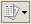

3. Butoane 1C:Retail
====================

Astfel, în majoritatea ferestrelor pentru a opera mai eficient în
această aplicație o să fie prezente următoarele butoane:

**1. Butonul** |image20| - "**Adăugare**" **(Insert**) are rolul de a
adăuga nouă înregistrare în listă;

**2. Butonul** |image21| -"**Modificare**" **(F2)** după cum îi este şi
denumirea, este util pentru modificarea anumitor informaţii sau
documente;

**3. Butonul** |image22|-"**Adăugare prin clonare**"(**F9**). Este
folosit pentru uşurarea muncii și economisirea timpului de operare. Se
poate folosi în cazul în care facem adăugarea în listă a unui nou
document pe care îl utilizăm în mod frecvent şi multe informaţii rămân
neschimbate (de exemplu: depozitul, furnizorul sau clientul, suma etc.).

***Atenţie!** Toate informațiile vor fi preluate automat din elementul
/ documentul care a fost selectat în momentul accesări butonului
"**Adăugare prin clonare**". Aceste informații trebuie verificate, iar
cele care nu corespund cerințelor dumneavoastră trebuie modificate (cum
ar fi: data, prețul, cantitatea, partenerul).

**4. Butonul** |image23| -"**Setează marcarea pentru ştergere**"
(**Del**), dar în acelaşi timp este folosit şi pentru anularea acestei
marcări pentru ştergere. Pentru a şterge obiectul marcat pentru
ştergere, trebuie să intrăm la "***Operaţiuni → Ştergerea* *obiectelor
marcate***", vom accesa butonul "**Verificare**". În urma acestei
verificări vom vedea dacă obiectul marcat pentru ştergere poate fi şters
(dacă apare bifa de culoare verde obiectul poate fi șters, iar dacă
apare culoarea roşie înseamnă că nu poate fi şters din cauza că acest
obiect poate fi legat de alt document și poate influența buna
funcționare a operaţiilor care urmează a fi înregistrate);

**5. Butonul** |image24| - "**Setează intervalul de timp**" este folosit
pentru setarea intervalului de timp. De exemplu, dacă dorim ca din lista
de facturi de aprovizionare să le vizualizăm doar pe cele dintr-o
anumită perioadă, putem seta perioada dorită.

***Atenţie!** Introducem la "**Interval arbitrar**" perioada care ne
interesează şi accesăm butonul "**OK**".

Pentru a anula această opţiune setată putem accesa din nou butonul cu
setarea perioadei, ştergem perioada introdusă şi accesăm butonul
"**OK**" sau altă variantă este aceea de a închide fereastra cu lista de
aprovizionări şi să intrăm din nou în listă.

|image25|

**6. Butonul** |image26| - "**Creare pe baza**" este util pentru
economisirea timpului de introducere a datelor informaționale în
program. Astfel, pe baza unui document creat se pot prelua datele în
alte tipuri de documente nemaifiind necesar să introducem din nou aceste
date. De exemplu, dacă am introdus o factură de la furnizor şi în
acelaşi timp trebuie să introducem plata, putem accesa butonul "**Creare
pe baza**" şi alegem "**Dispoziţie de plată**" (datele din factură se
păstrează, noi vom introduce seria şi numărul chitanţei de plată).
Observăm că am parcurs mai repede paşii, nu a mai fost nevoie să intrăm
la meniul "***Banca si casa → Dispoziţie de plată***" şi să facem o nouă
adăugare. Dacă suntem poziţionaţi cu click pe factura la care dorim să-i
operăm plata şi accesăm butonul "**Creare pe baza**", în urma acestei
accesări se va deschide următorul meniu derulant:

|image27|

**Atenţie!** Acest buton îl întâlnim în mai multe ferestre ale
programului şi are funcţii diferite în funcție de locul unde este
amplasat.

**7. Butonul** |image28| - "**Filtrare**" este folosit pentru filtrarea
şi sortarea unui număr foarte variat de operaţii. De exemplu, putem
filtra lista de aprovizionări, vânzări, dispoziţii de plată / încasare
după un anume depozit, număr NIR, partener, tipul operaţiei sau suma
documentului.

|image29|

**8. Butonul** |image30| - "**Dezactivarea filtrării**" are ca efect
dezactivarea filtrării făcute anterior.

**9. Butonul** |image31| - "**Validare**" este folosit pentru validare
documentelor din sistem mai exact înregistrarea lor din punct de vedere
contabil făcându-se trecerea în registrul contabil . Documentele pot fi
salvate dar, dacă acestea nu sunt validate și au starea de "**Anulat**"
nu generează note contabile.

**10. Butonul** |image32| - "**Anulare validare**" devalidează
documentele care au fost validate anterior, astfel, sistemul
**1C:Retail** le scoate din evidență până la o eventuală revalidare.

**11. Butonul** |image33| -"**Navigare**" are o multitudine de
facilităţi, astfel dacă suntem poziţionaţi cu click pe o factură din
lista de aprovizionări sau vânzări şi vrem să ştim dacă a fost achitată
– pentru uşurinţă accesăm butonul "***Navigare** → **Structură document
***" și vom vedea dacă această factură a fost achitată. În urma
accesării butonului "**Navigare**" din lista de aprovizionări apare
următoarea fereastră:

|image34|

**12. Butonul** |image35| - "**Actualizează lista curentă**" care
actualizează lista deasupra căreia este amplasat.

**13. Butonul** |image36| **-** "**Printare**"**-** din lista
"**Aprovizionări si servicii primite**" sau "**Vânzare și servicii
prestate**" deschide NIR-ul aferent facturii sau factura fiscală în
varianta de printare fără ca factura respectivă să mai fie deschisă și
vizualizată ușurând astfel munca celui care operează în aplicație.

**14. Butonul** |image37| **-** "**Printare**" - din Catalogul
"**Nomenclator de articole**" are rolul de a afişa "**Fişa de magazie**"
si "**Mişcare articole**" pentru articolul unde suntem poziţionaţi .
Observăm că este mult mai accesibil folosirea acestui buton, decât
accesarea meniului ''***Rapoarte** → **Stocuri*** →" **Mişcare
articole**'' sau ''**Fişa de magazie**''.

**15. Butonul** |image38| - "**Fișiere**" acest buton îl vom folosi
atunci când vom dori să introducem informaţii suplimentare pentru un
anume articol, întrucât avem posibilitatea de a adăuga şi o imagine
pentru un anumit produs.

**16. Butonul** |image39| - "**Imagine**". În cazul în care pentru un
anume produs avem selectată o imagine, dacă ne poziţionăm cu un click pe
produsul respectiv, în urma accesării butonului se va afișa imaginea
produsului.

**17. Butonul** |image40| - "**Mutare element în alt grup**"
(**Ctrl+Shift+M**) îl folosim atunci când se dorește mutarea unui
element dintr-un grup în altul.

**18. Butonul** |image41| "**Adăugare grup**" (**Ctrl+F9**) îl folosim
atunci când vrem să adăugăm un grup nou de articole, de depozite,
parteneri sau imobilizări.

**19. Butonul** |image42| - "**Căutare după număr**", acest buton îl
găsim în lista facturilor de vânzare şi are ca efect căutate unei
facturi dintr-o anumită perioadă care ne interesează.

**20. Butonul** |image43| - "**Selectare**" (**F4**) - deschide un
catalog în vederea selectării unui articol sau a unei informații.

**21. Butonul** |image44| **-** "**Deschide**" (**Ctrl+Shift+F4**) -
deschide o filă în care pot fi introduse sau modificate anumite
informații sau detalii.

**22. Butonul** |image45| - "**Afișează informații despre program**" are
ca efect afişarea informaţiilor despre program, de exemplu, ce versiune
avem sau unde este salvată baza de date.

.. |image25| image:: media/image27.png
   :width: 3.66667in
   :height: 3.20833in

.. |image27| image:: media/image29.png
   :width: 3.02083in
   :height: 3.15625in

.. |image34| image:: media/image36.png
   :width: 1.8125in
   :height: 3.19792in

.. |image36| image:: media/image38.png
   :width: 0.25in
   :height: 0.23958in

.. |image38| image:: media/image40.png
   :width: 0.25in
   :height: 0.25in
.. |image39| image:: media/image41.png
   :width: 0.25in
   :height: 0.22917in
.. |image40| image:: media/image42.png
   :width: 0.25in
   :height: 0.25in

.. |image43| image:: media/image45.png
   :width: 0.17708in
   :height: 0.21875in

