4. Informaţii despre societate şi configurare parametrii de evidenţă
====================================================================

Dacă n-aţi optat pentru introducerea informaţiilor despre societatea
dumneavoastră direct din ghidul de pornire sau doriţi să-le modificaţi
atunci veţi accesa catalogul "**Societăţi**" din meniu Societatea –
Societăţi. Aici pentru modificarea informaţiilor despre societatea
dumneavoastră veţi selecta înregistrarea introdusă deja şi în cazul în
care nu există vom introduce o înregistrare nouă. Să presupunem ca nu
aţi introdus deocamdată nici o informaţie, prin urmare veţi apăsa în
bara ferestrei butonul "**Adăugare**".

Ca rezultat pe ecran va fi afişată fereastra de mai jos unde veţi
proceda la introducerea informaţiilor despre societatea dumneavoastră
(prescurtarea, tipul societății, denumirea completă, codul unic de
identificare (CUI), numărul de înregistrare la Registrul Comerţului).

|image46|

Apoi după introducerea informaţiilor principale veţi trece la celelalte
file "**Conturi bancare**", "**Informaţia de contact**" şi "**Persoane
responsabile**" unde veţi completa celelalte informaţii.

După ce am introdus toate informaţiile despre societate vom trece la
următorul pas şi anume să configurăm parametrii de evidenţă a societăţii
şi desigur politica fiscală. Pentru a accesa parametrii

de evidenţă vom intra tot în meniul Societatea şi vom alege opţiunea
"**Parametrii de evidenţă**".

În următoarea fereastră veţi completa parametrii de evidenţă:
posibilitatea de a utiliza coduri la articole sau a seriilor, utilizarea
codurilor de bare, evidenţa decontărilor cu partenerii pe bază de
documente, utilizarea schimbului de date şi metoda utilizată pentru
numerotarea automată a facturilor şi chitanţelor etc.

|image47|

Înainte de a trece la introducerea primelor documente în **1C:Retail**
în mod obligatoriu trebuie să-i specificăm programului politica de
evidenţă a societăţii dumneavoastră. Pentru aceasta tot din meniul
Societăţi vom selecta opţiunea Politica de evidenţă. Şi în listă vom
apăsa butonul "**Adăugare**".

|image48|

Vom introduce data de început de an sau lună după care vom selecta
societatea şi apoi după caz se vor seta: metoda de evaluare a
stocurilor şi anume **FIFO**, **LIFO** sau **CMP**:

4.1. Creare şi configurarea utilizatorilor
------------------------------------------

La crearea unei baze de lucru noi o atenţie deosebită trebuie să
acordaţi creării şi configurării listei de utilizatori. La această
etapă, în afară de crearea utilizatorilor care vor lucra cu
programul **1C:Retail**, vom acorda drepturile de acces şi atribui
interfeţele de lucru pentru fiecare utilizator în parte.

Accesul în program, într-o anumită bază de date sau într-un anumit
catalog precum şi posibilitatea de a modifica, şterge sau adăuga
date în diferite documente ale programului este complet controlată
de către program pe baza drepturilor de acces şi interfeţelor de
lucru.

Un utilizator cu drepturi de **Administrator** poate crea un număr
nelimitat de utilizatori şi dacă doreşte poate configura
utilizatorii în catalog după grupe. Astfel fiecărui utilizator în
parte i se va atribui anumite drepturi şi restricţii. Drepturile
aferente unui utilizator se încarcă în momentul în care acesta îşi
introduce numele de logare şi parola corespunzătoare la lansarea
programului.

Următorul pas este de a introduce utilizatorii. Pentru aceasta vom
accesa catalogul de utilizatori din meniu "**Societatea –
Utilizatori**".

|image49|

Această pagină va permite să definiţi lista de utilizatori. Pentru
adăugarea unui utilizator nou puteţi utiliza butonul "**Adăugare**"
din bara de navigare sau combinaţia "**Alt-A**".

În fila "**Informaţii generale**" veţi configura informaţiile
generale pentru fiecare utilizator prin atribuirea unui nume (de
exemplu administrator, casier etc.) şi parole de intrare în program,
veţi specifica interfaţa de lucru şi selecta dreptul de acces.

|image50|

Se poate preciza faptul ca numele utilizatorului respectiv să se
regăsească în mod automat în lista de utilizatori la lansarea
programului, altfel dacă nu selectaţi bifa respectivă utilizatorul va
trebui să introducă manual numele. Dacă utilizatorul este responsabil de
emiterea facturilor fiscale atunci vă recomandăm să specificaţi
angajatul la câmpul "**Persoana fizică**" adică să selectaţi angajatul
căruia îi corespunde utilizatorul respectiv. Acest lucru va permite la
emiterea unei facturi să fie completate automat datele despre persoana
responsabilă (CNP, seria şi numărul buletinului de identitate etc.).
După ce am introdus datele generale despre utilizator putem trece la
următoare filă şi anume "**Setări**".

|image51|

Selectarea filei "**Setări**" va avea ca efect apariţia pe ecran a unei
structuri arborescente care va cuprinde casete de validare şi diverse
câmpuri ce va permite stabilirea unor valori implicite ce vor fi
preluate la crearea unor obiecte noi şi acordarea unor drepturi
speciale. Tot ca exemplu se poate preciza faptul ce Cotă de TVA va fi
atribuită automat produselor noi sau posibilitatea de a printa direct
formularele.

După ce aţi configurat setările utilizatorului puteţi trece la
următoarea filă unde puteţi specifica datele de contact al
utilizatorului.

*Atenție! Numai un utilizator cu drepturi de administrator poate adăuga
utilizatori noi și datelor oricărui altui utilizator existent. Dacă un
utilizator are drepturi de acces Operator atunci va putea configură
numai setările.

Pentru a consulta lista utilizatorilor conectați online la program
puteţi accesa fereastra respectivă din meniu "**Unelte → Utilizatori
activi**". Pentru fiecare utilizator în parte vor fi afişate: Numele
utilizatorului conectat, sesiunea în care lucrează în acel moment,
data/ora la care a intrat şi calculatorul de pe care s-a conectat.

4.2. Lista de depozite
----------------------

Dacă lucraţi cu mai multe gestiuni, magazine, şantiere de lucru pentru
construcţii, materiale trimise spre prelucrare la terţi, etc. atunci la
această etapă trebuie să treceţi la creare listei de depozite (gestiuni)
pe care o vom accesa din meniu "**Stocuri**" şi apoi veţi selecta
opţiunea "**Depozite**".

În lista de depozite veţi observa o poziţie deja introdusă. Poziţia
"**Depozit**" apare implicit, logica existenţei acestei poziţii este că
orice societate are măcar o gestiune (depozit)! Dacă nu aveţi în firmă
nici un depozit căruia să i se potrivească această denumire, atunci
n-aveţi decât să modificaţi această înregistrare. Apăsaţi dublu click pe
câmpul "**Denumire**" sau butonul "**Modificare**".

În continuare aveţi câmpul disponibil "**Tipul de depozit**" unde dacă
depozitul respectiv reprezintă un magazin veţi selecta opţiunea
"**En-detail**", iar în cazul în care gestiunea reprezintă doar un alt
depozit din care distribuiți marfa veţi opta pentru opţiunea
"**En-gros**".

Pentru o gestiune de tip "**En-detail**" puteţi opta pentru **metoda
global-valorică**, pentru aceasta se va bifa opţiunea respectivă.

În cazul metodei global-valorice programul **1C:Retail** oferă
posibilitatea să introduceţi la cumpărare şi vânzare fiecare articol din
factură şi apoi să listaţi după caz NIR-ul sau factura fiscală. Deşi
veţi introduce mai multe rânduri în grila documentului, programul va
genera numai o înregistrare pentru o gestiune global-valorică. Prin
urmare pentru acest tip de evidenţă nu se va ţine evidenţa cantitativă a
mărfurilor. Pentru a utiliza această facilitate bifaţi opţiunea
"**Posibilitatea de a introduce articole pentru a lista NIR-ul sau
factura**".

De asemenea aici aveţi posibilitatea de a introduce şi numele
gestionarului la fila "**Suplimentar**"care preia produsele sau seria
ataşată pentru facturile fiscale sau avizele de expediţie pentru fiecare
depozit în parte.

|image52|

Depozitele create se vor utiliza atât la achiziţii de produse (la
modulul de aprovizionări-facturi furnizor) care pot fi introduse direct
într-un anumit depozit, cât şi la ieşirea produselor cu facturi (la
modulul vânzări-facturi clienţi). Aici aveţi grijă să selectaţi același
depozit în care aţi operat intrarea.

4.3. Creare nomenclator de articole
-----------------------------------

Catalogul "**Nomenclator de articole**" este destinat pentru crearea
articolelor şi ataşării acestora a diverselor atribute,
caracteristici, descriere detaliată precum şi imagini. Pentru
crearea nomenclatorului de articole, veţi parcurge următorii paşi:
din meniul principal accesaţi "**Stocuri**", apoi prima opţiune
"**Nomenclator de articole**".

|image53| După cum observaţi din imaginea de mai sus **1C:Retail**
permite structurarea nomenclatorului de articole în grupuri şi
subgrupuri în funcţie de nevoile dumneavoastră. Astfel aveţi
posibilitatea de a vizualiza nomenclatorul de articole atât ca structura
arborescentă (stânga), dar şi ca listă pe fiecare grup sau subgrup în
parte ajungând până la nivel de articol.

Pentru fiecare articol pot fi vizualizate rapid informaţii foarte utile
precum: stocul existent, depozitul unde se afla, preţurile actuale pe
fiecare depozit şi loturile neînchise. Informaţiile afişate pot fi
filtrate (de exemplu pot fi afişate numai articolele dintr-un anumit
depozit).

Pentru o identificare uşoară de către vânzător a articolelor uşor
confundabile acestea pot fi asociate cu imagini, aşa încât în momentul
vânzării ele pot fii uşor identificate de către utilizator. În afară de
denumire, suplimentar puteţi utiliza codul articol şi/sau un număr
nelimitat de coduri de bare, pentru identificare articolelor.

Pentru a introduce un articol nou în nomenclator, veţi face ClickMouse
pe grupul din care va face parte articolul respectiv şi veţi acţiona
butonul "**Adăugare**" sau combinaţia "**Alt + A**". În cazul în care
grupurile de articole existente nu corespund structurii din cadrul
societăţii dumneavoastră, veţi putea crea alte grupuri cu ajutorul
comenzii "**Grup nou**". După ce aţi terminat de definit grupele de
produse dorite puteţi trece la introducerea propriu-zisă a articolelor.

|image54|

Acum sunteţi în faţa ferestrei ce va permite introducerea informaţiilor
despre articolele de stoc. Dacă sunteţi poziționați cu cursorul pe
câmpul "**Prescurtare**" puteţi introduce in acel câmp prescurtarea
dorită pentru articol.

***Atenție!** Pentru câmpul "**Prescurtarea**" se introduce doar
denumirea articolului fără a se mai specifica alte informații
suplimentare. Mențiuni suplimentare se pot face în câmpul "**Denumirea
completă**" aceasta din urma va fi folosita la imprimare.

Dacă este cazul se va selecta în câmpul precedent cu ajutorul Mouse-lui
grupul de articole din care face parte articolul respectiv. În următorul
câmp se va genera denumirea completă a articolului. În caz de necesitate
veţi adăuga alte menţiuni suplimentare. Această denumire va fi utilizată
la listare. Câmpul "**Cod articol**" nu este unul obligatoriu, se va
utiliza în cazul în care societatea ţine o evidenţă a articolelor în
funcţie de un anumit cod intern. În acest caz, se va introduce manual
codul articolului. Trebuie menţionat faptul că în nomenclatorul de
articole, pe lângă înregistrările obişnuite care se referă la stocuri,
există posibilitatea de a introduce şi elemente care vizează diverse
servicii "primite" sau "prestate". Astfel în cazul în care elementul
reprezintă un serviciu se va bifa opţiunea "**Serviciu**".

În continuare veţi alege cota TVA corespunzătoare articolului respectiv,
prin acţionarea listei de selectare ("**...**") ataşată butonului
"**Cota de TVA**" din fila "**Date generale**"**.** Dacă pentru
utilizatorul curent a fost specificată o cotă de TVA implicită în
setări, atunci la introducerea unui articol nou câmpul va fi automat
completat cu valoarea respectivă. Apoi vom acţiona butonul "**Salvare**"
şi vom proceda la completarea datelor din filele următoare.

|image55|

**1C:Retail** permite lucrul cu mai multe unităţi de măsură. Astfel
articolele pot fi achiziţionate de exemplu în seturi şi vândute la
bucată, sau achiziţionate în kg şi vândute în grame.

Pentru aceasta, în fila "**Unităţi de măsură**" vom alege neapărat
unitatea de măsură de bază a articolului folosind lista de selectare
ataşată butonului "**UM de bază**". Dacă pentru utilizatorul

curent s-a specificat o unitate de măsură implicită în setări, atunci la
introducerea unui articol nou

câmpul va fi automat completat cu valoarea respectivă.

Să explicăm mai detaliat cum **1C:Retail** operează cu unităţile de
măsură. În mod normal în această filă se definesc toate unităţile de
măsură utilizate la comercializarea articolului. Programul permite
convertirea automată dintr-o unitate de măsură în alta pe baza unui
coeficient. Pentru început vom defini ***unitatea de măsură de bază***.
UM de bază reprezintă acea unitate de măsură în raport cu care vor fi
calculate celelalte unităţi de măsură. Ca rezultat dacă veţi defini în
grilă mai multe unităţi de măsură atunci trebuie să specificaţi în care
din unităţile de măsură introduse se va ţine evidenţa stocului (''***UM
stocuri**''*).

|image56|

**1C:Retail** oferă posibilitatea lucrului cu coduri de bare pentru
articolele din nomenclator, astfel încât un produs poate să aibă oricâte
coduri de bare asociate; pentru articolele ce nu au o codificare de la
furnizor, se pot lista etichete cu cod de bare generat din program,
inclusiv cu preţul de vânzare, pe orice imprimantă cu jet sau laser.
Odată generat codul de bare şi printat pe etichetă, lucrul
utilizatorului cu echipamentele periferice (case de marcat, cântare
electronice, cititoare de coduri de bare) conectate la program va fi
îmbunătățit.

Pentru a genera din program un cod de bare pentru un articol, vom trece
pe fila "**Coduri de bare**"**,** vom apăsa butonul "**Adăugare**"**,**
apoi ClickMouse pe opţiunea "**Cod de bare nou**" pentru ca programul să
genereze codul de bare şi vom confirma operaţiunea cu "**Da**". La fel
veţi proceda şi pentru următoarele coduri de bare pe care doriţi să le
adăugați, fie pentru același articol, fie pentru articole diferite.
Pentru a salva informaţiile introduse şi a închide forma curentă vom
acţiona butonul "**OK**" sau vom tasta combinaţia "**Ctrl + Enter**" şi
vom proceda la fel pentru adăugarea tuturor articolelor de stoc.

La următoarea filă va fi afişată lista de preţuri care a fost atribuită
pentru articolul respectiv. Dacă aţi introdus toate informaţiile dorite
pentru articolul respectiv atunci pentru finalizare veţi

apăsa butonul "**Salvare**" sau veţi tasta combinaţia "**Ctrl +
Enter**".

4.4. Listă de parteneri
-----------------------

În continuare vom crea baza de date cu clienţii şi furnizorii
societăţii. Pentru aceasta, veţi parcurge următoarele etape: din meniul
"**Aprovizionări**" sau "**Vânzări**" veţi accesa catalogul
"**Parteneri**". Programul oferă posibilitatea de a crea pe lângă
partener şi grupe de parteneri în funcţie de nevoile utilizatorului.
Astfel, veţi putea crea grupuri de parteneri cu ajutorul comenzii
"**Grup Nou**".

|image57|

După crearea grupurilor dorite, veţi acţiona dublu click pe grupul în
care doriţi să adăugaţi partenerul respectiv. Acum veţi acţiona butonul
"**Adăugare**" sau combinaţia "**Alt+A**" şi se va deschide o fereastră
numită "**Partener: Nou**", în care se vor completa câmpurile aferente
fiecărei file a datelor despre partener: **date generale, informaţia de
contact, conturi bancare şi contracte, tipuri de preţuri**. Pentru
început se vor completa câmpurile din fila "**Date generale**" şi pentru
a fi active următoarele file, veţi acţiona butonul "**Salvare**".

|image58|

***Atenție!** De regula pentru câmpul "**Prescurtare**" se introduce
denumirea partenerului fără a se specifica forma sa de organizare sau
alte informații suplimentare. Identificarea ulterioară a partenerilor în
listele de căutare folosind căutarea rapidă prin tastatură impune ca
prescurtările introduse să nu aibă pe primele poziții grupuri de
caractere identice. Cu alte cuvinte, dacă introduceți cu consecvență la
prescurtatea partenerului "S.C."pe prima poziție ,atunci în lista de
căutare vor apărea constant pe primele poziție aceste caracter, iar
căutarea rapidă vă va impune să tastați prescurtarea partenerului
precedată de acest grup de caracter. Prin urmare vă recomandam la câmpul
"**Prescurtarea**" să renunțați la particular S.C. SAU P.F.

După completarea acestui câmp, veţi alege în câmpul "**Tip**" dacă
partenerul respectiv este persoana fizică sau juridică. În cazul
**persoanelor juridice**, următoarea bifa va fi cea de *«furnizor»*,
respectiv *«client»*. Apoi veţi introduce CUI-ul, precum şi Numărul de
înregistrare la Registrul Comerţului. Odată completate aceste date, veţi
acţiona butonul "**Salvare**" pentru a putea completa următoarele file
ce conţin informaţii suplimentare despre partener: informaţia de contact
(adresa partenerului – sediu social, punctul de lucru, telefon, persoana
de contact), conturile bancare şi contractele (puteţi adăuga conturile
bancare ale partenerului, precum şi tipul de contract – contract
furnizor, respectiv contract client). Aceste file cu informaţii
suplimentare nu sunt obligatorii, ele se vor completa în cazul în care
în societate se doreşte o evidenţă clară a partenerilor.

În cazul în care partenerul este o **persoană fizică** şi aţi ales acest
lucru, veţi completa câmpurile cerute de program, respectiv actul de
identitate (BI/CI) şi CNP-ul, şi veţi bifa dacă persoana fizică este
*«furnizor»* sau *«client»*.

Opţiunea "**Nu este rezident**" este utilizată pentru parteneri
nerezidenţi în România. Apoi veţi acţiona butonul "**Salvare**".

***Atenție!** Dacă aveți acces la internet atunci introducerea datelor
despre partenerii noi se poate face mult mai ușor si rapid
introducând-se numai CUI-ul partenerului si automat toate datele se
descărca de pe MFinante.ro. Prin aceasta facilitate, timpul de
introducere a datelor în sistem a scăzut considerabil, făcând-se in
același timp si verificarea corectitudinii datelor despre parteneri.

După completarea tuturor datelor despre partener, veţi acţiona butonul
"**OK**" sau combinaţia "**Ctrl + Enter**". Acum aţi salvat informaţiile
despre partener şi aţi şi ieşit. La fel veţi proceda şi pentru ceilalţi
parteneri.

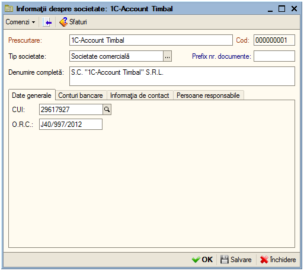
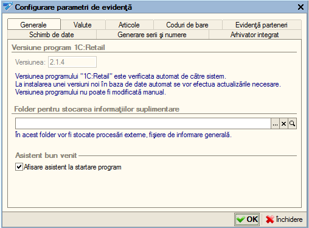
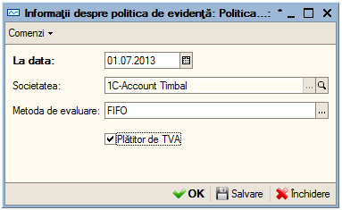
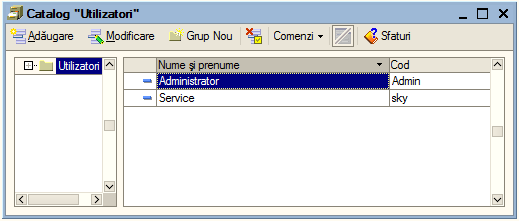
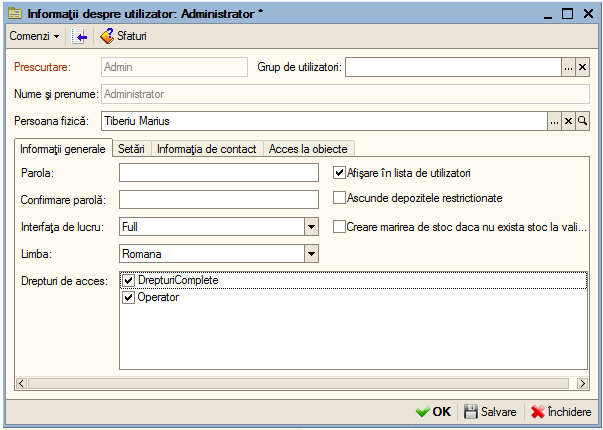
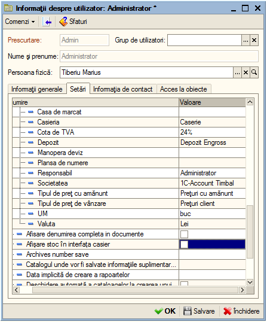
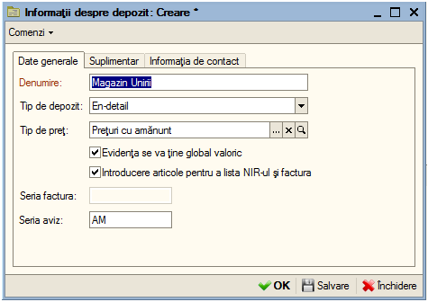
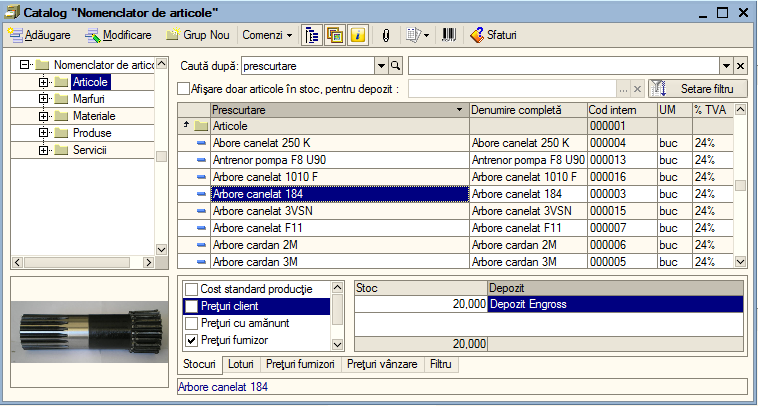
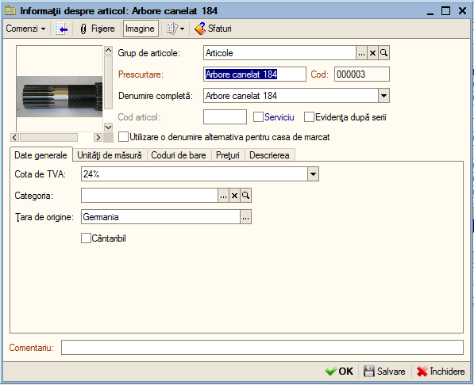
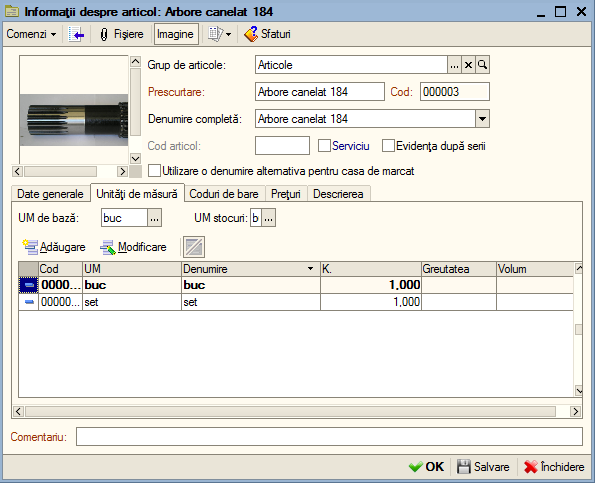
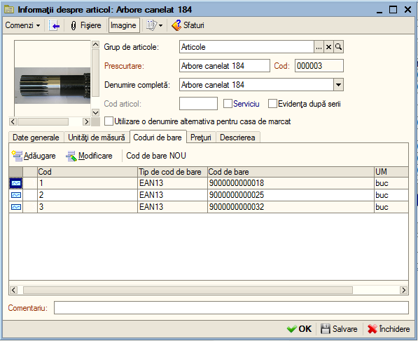
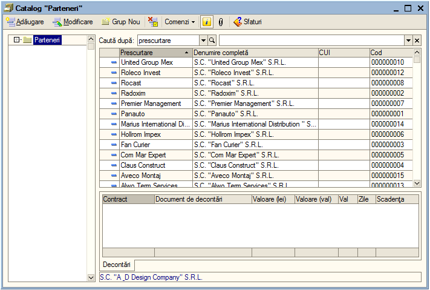
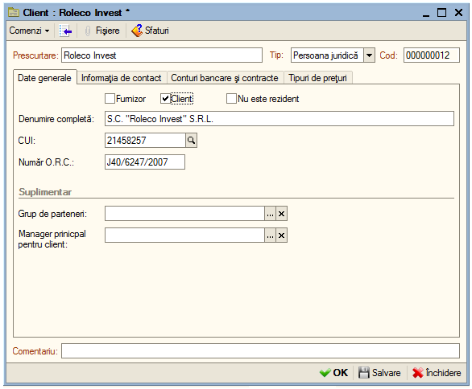
