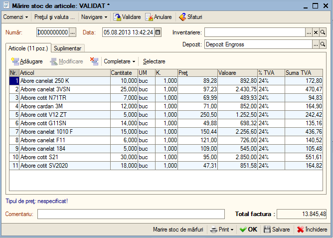
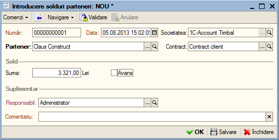
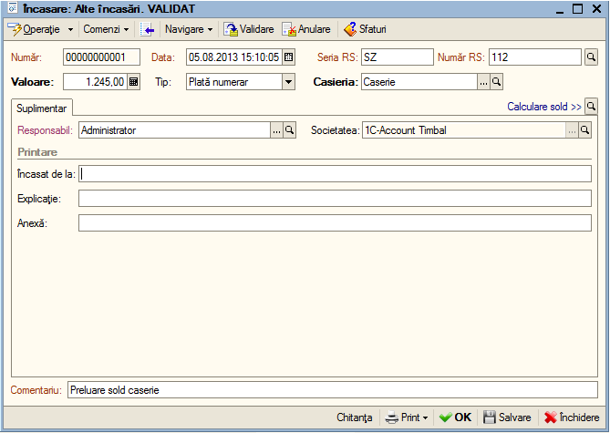

5. Introducere date iniţiale
============================

Modul de funcţionare introdus de program, permite pe lângă traseul
descris mai sus, o cale mai dinamică, în sensul că completarea
cataloagelor poate fi făcută pe măsura introducerii datelor iniţiale. Cu
alte cuvinte, dacă la introducerea datelor iniţiale veţi întâlni
articole sau parteneri care nu sunt introduse în program atunci puteţi
să le introduceţi.

5.1. Introducere stocuri de articole
------------------------------------

În cadrul acestei etape, se presupune că aţi efectuat deja inventarul
faptic al stocului de articole şi va introduce stocul real de articole
astfel: veţi acţiona meniul "**Stocuri**", opţiunea "**Mărire stoc de
articole**". Acum sunteţi în faţa listei **''Mărire stoc de articole**''
în care veţi acţiona butonul "**Adăugare**" sau combinaţia "**Alt-A**"
şi se va deschide documentul **''Mărire stoc de articole: NOU**'' în
care veţi acţiona din nou butonul "**Adăugare**" şi veţi introduce pe
rând informaţiile despre fiecare articol (denumire, cantitate, preţ).
Apoi veţi acţiona butonul "**OK**" sau combinația "**Ctrl +
Enter**"**.**

|image59| În continuare, veţi putea introduce soldurile partenerilor
(furnizori, clienţi) la momentul începerii lucrului cu programul.

5.2. Introducere solduri parteneri
----------------------------------

Pentru introducerea soldurilor iniţiale ale partenerilor, veţi parcurge
următorii paşi: veţi accesa meniu "**Societatea**", opţiunea
"**Introducere solduri parteneri**". Acum sunteţi în faţa listei

''Introducere solduri parteneri'' în care veţi acţiona butonul
"**Adăugare**" sau tasta **Insert** şi se va deschide documentul
**''Introducere solduri parteneri: NOU''**, în care veţi acţiona din nou
"**Adăugare**"

sau combinaţia "**Alt–A**" şi veţi introduce denumirea partenerului
pentru care introduceţi soldul,

contractul, valoarea şi veţi bifa, daca este cazul, dacă soldul a fost
determinat pe baza unui avans. Foarte important este câmpul ''Data'', pe
care îl veţi completa cu data la care a fost stabilit soldul pentru
partenerul respectiv.

|image60|

5.3. Introducere solduri casierie şi bancă
------------------------------------------

Pentru a introduce soldul pentru casierie şi bancă, veţi accesa meniu
"**Casierie**", opţiunea "**Încasare**". Prin urmare se va introduce
pentru fiecare casierie şi cont bancar câte un document de încasare cu
data la care începeţi lucrul cu programul.

Astfel pentru a introduce un document nou apăsaţi butonul
"**Adăugare**".

|image61|

În continuare:

-  Selectaţi tip de operaţie "**Alte încasări**";

-  Introduceţi valoare soldului la câmpul "**Valoare**";

-  La câmpul "**Tip**" pentru casierie veţi specifica – încasare numerar
iar pentru bancă – încasare virament;

-  În funcţie de tipul de încasare la următorul veţi specifica exact
casieria sau contul bancar

pentru care introduceţi soldul.

