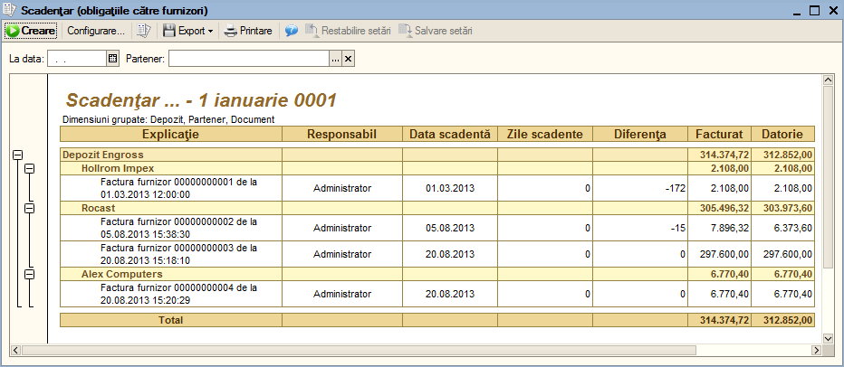

6. Operare în modulul "Aprovizionări"
=====================================

Am parcurs împreună, în cadrul etapei anterioare, preluarea datelor la
momentul începerii lucrului cu programul. În urma autentificării
utilizatorului este afişată fereastra principală unde în partea de sus a
ecranului puteţi citi, pe bara de titlu, sesiunea de lucru a programului
"**1C:Enterprise**", denumirea programului, denumirea societăţii
dumneavoastră şi numele utilizatorului curent. Avem apoi bara de meniu
principală şi bara de instrumente şi butoane rapide ce pot fi activate
şi utilizate în funcţie de necesităţi.

Meniul este structurat pe câteva opţiuni principale din denumirea cărora
puteţi intui ce operaţiuni cuprind sau ce informaţii pot releva. Toate
secţiunile programului pot fi utilizate de la simplu la complex sau de
la general la detaliu în funcţie de nevoile informaţionale ale firmei.

Înregistrarea operaţiilor curente referitoare la intrările în stocuri se
realizează cu ajutorul secţiunii "**Aprovizionări**". Acţionând această
secţiune, se va deschide lista opţiunilor:

-  document "**Factura furnizor**" - pentru introducerea facturilor
primite de la furnizori;

-  document "**Aviz furnizor**" - înregistrarea intrărilor de articole
pe bază de aviz de expediţie;

-  raport "**Jurnal pentru cumpărări**";

-  document "**Plata**" - efectuarea plăţii către furnizori;

-  raport "**Decontări cu parteneri**" - situaţia partenerilor
(furnizori, clienţi);

-  catalog "**Parteneri**" - lista partenerilor (furnizori, clienţi);

-  raport "**Avansuri furnizor**"

-  raport "**Scadenţar**"

-  raport "**Datorii furnizori**" - graficul datoriilor către furnizori;

-  raport "**Avize furnizor nefacturate**"

-  raport "**Retur la furnizor**"

-  raport "**Aprovizionări**" - raport privind aprovizionările
efectuate. În continuare vom explica mai detaliat fiecare dintre
opţiuni.

6.1. Factura furnizor
---------------------

Activitatea principală a oricărei firme, în cursul unei luni începe cu
aprovizionarea mărfurilor. Pentru a opera facturile primite de la
furnizori veţi accesa secţiunea "**Aprovizionări**", opţiunea "**Factura
furnizor**". Ca urmare va fi deschisă lista "**Facturi furnizori**",
unde pentru fiecare aprovizionare sunt afişate următoarele informaţii:
data facturii, numărul intern atribuit de program fiecărui document,
seria şi numărul facturii, partenerul (furnizorul), valoarea totală a
facturii, depozitul unde s-a efectuat recepţia, numărul notei de
recepţie. Pot fi efectuate filtrări şi sortări nelimitate ale listei
(Comenzi -> Setare Lista de Filtre şi Opţiuni de Sortare...) după
câmpurile oferite spre selecţie în funcţie de nevoile utilizatorului.

Tot în cadrul acestei liste fără a deschide factura o putem anula, cu
ajutorul butonului "**Anulare**" (caz în care aceasta nu va fi ştearsă,
însa se va anula intrarea în stoc a mărfurilor), putem valida o factură
rămasă neînregistrată sau anulată pentru corecturi (butonul
"**Validare**"), se poate marca pentru ştergere (butonul "**Marcare
pentru ştergere**"), modifica (butonul "**Modificare**"), sau adăuga o
nouă factură (butonul "**Adăugare**"), se poate lista direct nota de
recepție (butonul imprimanta), se poate vedea structura documentului
("Navigare -> Structura document").

Mai mult, direct de aici din lista de aprovizionări, pe baza unei
facturi validate se poate crea un document care urmează pe fluxul
informaţional. Pentru aceasta folosim butonul "**Creare pe baza**"

care ne permite să efectuăm un bon de consum, o vânzare sau o plată.

Dar, să operăm împreună un exemplu de aprovizionare.

Pentru introducerea unei facturi de mărfuri sau servicii pentru început
în lista aprovizionărilor veţi apăsa butonul "**Adăugare**" sau
combinaţia "**Alt-A**" , veţi alege tipul operaţiei (aprovizionare
articole sau avans furnizor, după caz, după care veţi confirma cu
"**OK**") şi se va deschide un document, intitulat "**Factura
furnizor:Nou**", în care se vor completa câmpurile respective cu datele
din factură.

**Atenție!** Programul va solicita automat tipul operației doar în cazul
în care a fost activată opțiune la setările.

Câmpul "**Număr**" va fii completat automat de program în momentul
validării documentului, este un număr intern atribuit de **1C:Retail**
fiecărui document şi nu are legătură cu numărul facturii. Numărul va fi
format din prefix (dacă este specificat unul în catalogul
"**Societăţi**" sau dacă se efectuează schimb de date între puncte de
lucru) şi următorul număr intern disponibil pentru acest tip de
document. Pentru rapiditatea introducerii acest câmp este sărit deoarece
se presupune că numărul propus va fi acceptat implicit.

Dacă operaţia introdusă presupune listarea unui NIR, atunci după
validarea documentului programul va genera următorul număr al
**NIR-ului**. Numerotarea şi evidenţa NIR-ului se efectuează distinct de
numerele interne ale documentelor. Numărul NIR va fi afişat în acelaşi
câmp cu numărul intern, astfel: număr intern document / număr NIR.
Pentru a modifica numărul NIR-ului apăsaţi butonul de selectare
"**...**".

|image62|

În fereastra apărută dacă doriţi aveţi posibilitatea să modificați
numărul NIR-ului şi în cazul există documente care preced documentul
respectiv atunci trebuie să le renumerotaţi, pentru aceasta apăsaţi
butonul "**Recalculare numere posterioare**". Dacă numărul introdus este
deja utilizat atunci programul va schimba culoarea textului şi mai jos
va afişa factura care are deja numărul NIR-ului respectiv.

Următorul câmp este "**Data**", care corespunde cu data facturii
primite de la furnizor. Prin urmare veţi culege de la tastatură
data, luna şi veţi tasta "**Enter**" (programul va completa automat
anul - cu cel curent). În mod asemănător puteţi culege de la
tastatură doar ziua şi pentru acceptare să tastaţi "**Enter**" în
acest caz programul va completa automat luna şi anul curent.

În continuare veţi culege de la tastură seria facturii primite de la
furnizor în câmpul "**Seria RS**" şi respectiv numărul facturii în -
"**Număr RS**" (RS – document cu regim special).

În continuare veţi fi poziţionat în câmpul "**Partener**" – în
continuare aveţi mai multe soluţii de a alege partenerul:

-  dacă partenerul a fost deja introdus în catalog atunci direct în câmp
începeţi să scrieţi de la tastatură primele caractere din denumirea
prescurtată a partenerului şi tastaţi "**Enter**". Pe ecran se va
afişa o listă cu parteneri denumirea cărora coincide cu caracterele
culese. Selectaţi partenerul dorit;

-  apăsaţi tasta "**F4**" sau un click pe butonul de selectare "**…**".
Efectul apăsării va fi afişarea, catalogului de parteneri. În
continuare efectuăm o căutare rapidă, în catalogul de

parteneri, de exemplu vom căuta partenerul "**Ciocom**". Astfel vă
poziţionaţi după câmpul

"**Caută după** - prescurtare" şi scrieţi de la tastatură primul
simbol.

Efectul apăsării simbolului "**C**" este următorul: lista de parteneri
va fi automat filtrată şi va conţine toţi partenerii care au în
prescurtarea sa simbolul "**C**". Dacă în continuare apăsaţi următorul
caracter din denumirea partenerului (adică "I"), lista de parteneri se
va micşora şi va conţine deja numai parteneri care oriunde din
prescurtarea sa au simbolurile "**Ci**". Şi astfel continuați să tastaţi
caracterele rămase până ce lista de parteneri se va restrânge şi
cursorul se va poziţiona pe partenerul dorit "**Ciocom**". Odată
partenerul găsit pentru preluarea lui în factură veţi tasta
"**Ente** r".

Dacă partenerul dorit nu există deocamdată în catalog, atunci apăsaţi
butonul "Adăugare" şi urmaţi instrucţiunile pentru completarea datelor
pentru parteneri (vezi: pct.3.5 Lista de parteneri).

După introducerea partenerului câmpul "**Contract**" va fi completat
automat cu contractul implicit al partenerului, aveţi posibilitatea să
selectaţi un alt contract.

Câmpul "**Depozit**" îl veţi alege din lista depozitelor deja existente.
Pentru a specifica depozitul trebuie să apăsaţi aşadar butonul de
selectare "…" din câmpul respectiv. În lista de căutare veţi

observa depozitele introduse cu ajutorul ghidului de pornire. Dacă nu
aţi definit la acea etapă ghidul de pornire nici un depozit sau
caracteristicele depozitului definit nu corespund cu cele reale, atunci

n-aveţi decât să modificaţi această înregistrare.

**Atenție!** Depozitul pentru care a fost introdus cel puţin un document
în program, ulterior următoarele caracteristici: "**Tipul de depozit**"
şi "**Evidenţă global-valorică**" nu vor putea fi modificate.

|image63|

Înainte de a explica modalităţile de introducere a articolelor în
grilă trebuie să fie explicate unele aspecte privind depozitul
indicat în document. Deoarece în funcţie de caracteristicele
depozitului specificat conţinutul grilei se va modifica în mod
automat. Astfel pot exista următoarele patru situaţii:

-  Pentru un depozit de tip "**En-gros**" – grila nu va conţine
coloanele privind adaosul comercial ca: **"% Adaos**", "**Adaos**",
"**Preţ amănunt**" şi "**Total amănunt**";

-  Pentru un depozit de tip "**En-detail**" (atenţie căsuţa privind
**evidenţa globală nu este bifată**) deci **1C:Retail** va ţine o
evidenţă cantitativă – pentru acest caz grila va conţine suplimentar
coloanele "%adaos", "**Adaos**", "**Preţul cu amănuntul**" şi
"**Total amănunt**". Ca urmare **1C:Retail** va introduce în grilă în
mod automat pentru fiecare articol introdus preţul cu amănuntul;

-  Pentru un depozit de tip "**En-detail**" evidenţa căruia se va ţine
global valoric (atenţie căsuţa privind **evidenţa globală este
bifată**) – ca urmare grila va conţine coloane doar pentru totaluri
ca: "**Valoare**" (valoarea facturii fără TVA), "**%TVA**",
"**TVA**", "**Total**" (total factură cu TVA), "**Adaos**" şi
"**Valoare amănunt**";

-  Pentru un depozit de tip "**En-detail**" evidenţa căruia se va ţine
global valoric cu posibilitatea de a lista NIR-ul şi facturi fiscale
(atenţie suplimentar **este bifată** căsuţa "**Posibilitatea de a
introduce articole pentru a lista NIR-ul şi factura**") – grila va
conţine coloanele privind adaosul comercial mai puţin coloana "**Preţ
amănunt**". Astfel veţi introduce articole în grilă ce va oferi
posibilitatea de a lista NIR-ul şi în cazul unei vânzări – factura
fiscală.

Apoi, în fila **Articole**, se va acţiona butonul "**Adăugare**" şi se
vor completa toate informaţiile despre articolele din factură (denumire
produs, cantitate, preţ unitar, etc.). Dacă factura conţine servicii
prestate alături de articole, sau conţine numai servicii, acestea vor fi
operate separat în fila **Servicii.**

În situaţia în care articolele nu există în nomenclatorul de articole,
acestea pot fi adăugate în două moduri:

-  selectând din meniul principal nomenclatorul de articole;

-  varianta adăugării chiar în timpul introducerii datelor din factură.
Pentru aceasta, se accesează butonul ''trei puncte'' (**...**) sau
tasta F4 (în cazul în care vă aflaţi chiar în câmpul dorit) care va
deschide automat nomenclatorul de articole care permite între alte
opţiuni şi introducerea unui element nou. Acest element nou, odată
introdus rămâne în baza de date şi ulterior poate fi modificat. El nu
se şterge odată cu închiderea facturii. Mai mult prin acţionarea
butonului ''deschide'' (în forma de lupiţă), puteţi obţine
informaţiile detaliate despre elementul selectat, având şi aici
posibilitatea de modificare şi salvare a modificărilor.

Dacă în cazul unui depozit de tip "**En-detail**" veţi modifica preţul
în câmpul "**Preţ amănunt**" atunci **1C:Retail** va haşura linia
respectivă din grilă cu o nuanţă roşie. Deoarece **1C:Retail** ţine o
evidenţă a preţurilor de vânzare cu amănunt şi nu permite modificarea
lor directă. În această situaţie apăsaţi butonul "**Preţ amănunt**"
(apărut în bara de comenzi puţin mai sus de grilă). **1C:Retail** va
crea un document de schimbare de preţ şi va permite listarea unui proces
verbal de modificare de preţ. La validarea documentului de schimbare de
preţ programul va modifica adaosul şi TVA pentru fiecare lot de articole
aflat în stoc.

***Atenție!** Ați observat în rândul de butoane mai sus de grilă,
butonul "**Discount**" care a fost tot timpul pe ecran si pe care îl
veți folosi doar dacă furnizorul a acordat un discount de preturi.
Astfel la apăsarea lui ca efect sub grila vor fi afișate câmpuri pentru
introducerea discountului.

Continuaţi introducând rând de rând în grilă toate articolele din
factură.

Dacă în societate se ţine o evidenţă a articolelor după codurile de
bare, acestea pot fi folosite şi la introducerea mărfurilor din factura
furnizorului, fie cu ajutorul cititorului de coduri de bare (caz în care
articolul apare în grila fără a introduce de la tastatura alte detalii
suplimentare), fie prin introducerea de la tastatura a cifrelor ce
formează codul de bare (cu ajutorul unui dublu click în interiorul
câmpului **''Cod de bare**'' sau acţionând butonul ''**cod de bare**'').

După ce am introdus toate articolele din factură şi am operat discountul
(dacă este cazul), nu mai rămâne decât să salvaţi documentul selectând
una din opţiunile puse la dispoziţie de program: butonul "**Salvare**" –
datele vor fi salvate în program, însă formulele contabile nu vor fi
generate; butonul "**OK**" (combinaţia "**Ctrl + Enter**") – datele vor
fi salvate şi validate. Suplimentar programul va închide în mod automat
documentul; butonul "**Validare**" (din bara de navigare a documentului)
– documentul va fi salvat şi validat. Spre deosebire de opţiunea
precedentă fereastra documentului nu va închisă.

După ce am validat documentul de aprovizionare, acum se poate lista nota
de recepţie, cu ajutorul butonului "**Print → NIR**" sau direct butonul
"**NIR**" din partea inferioară a documentului de aprovizionare. Dacă
doriţi în NIR-ul listat să fie specificat "**Numele şi prenumele
gestionarului**" veţi accesa ultima filă "**Suplimentar**" şi la câmpul
"**Gestionar**" veţi selecta angajatul.

Alte detalii necesare cum sunt scadenţa facturii, gestionarul, precum şi
orice alt comentariu se operează la fila ''**Suplimentar**''.

6.2. Operaţia "Retur furnizor"
------------------------------

Tot legat de aprovizionare avem şi **returul la furnizor**. Acesta se
operează ca şi o factură furnizor, iar deosebirea este dată de butonul
"**Completare retur la furnizor**", bifa "**Retur**" şi de selectarea
documentului pentru care se face returul.

Din lista de facturi furnizori, veţi apăsa butonul "**Adăugare**" sau
combinaţia "**Alt-A**"**.** Se va deschide documentul **''Factura
furnizo** r: Nou'', în care veţi completa câmpurile din partea superior
a documentului cu informaţiile despre data, seria şi numărul facturii,
partenerul, depozitul şi contractul, vezi punctul 5.1. Document
"**Factura furnizor**".

Apoi veţi acţiona butonul "**Completare** → **Completare retur la
furnizor**". Se va deschide acum o nouă fereastră, numită **''Selectare
articol** e'', în care veţi acţiona click pe plusul (**+**) aflat în
partea stânga a ferestrei.

|image64|

Pentru a se detalia factura de retur după articole, veţi acţiona dublu
click pe articolul pe care doriţi să îl returnaţi, apoi veţi completa
cantitatea returnată, se va acţiona "**OK**" pentru a se confirma
cantitatea returnată şi apoi încă o data veţi acţiona "**OK**" pentru a
aduce în factura de retur produsul returnat.

|image65|

Acum puteţi observa în grilă de articole că este bifat returul şi este
completat şi documentul pentru care se face returul. Pentru finalizare
veţi salva returul la furnizor, prin apăsarea butonului "**Validare**"
sau combinaţia "**Ctrl + Enter**".

6.3. Document "Aviz furnizor"
-----------------------------

Nu vom mai intra în detalii legate de introducerea datelor pe acest tip
de document, aşa cum am făcut în cazul de la punctul **5.1. Factura
furnizor**, deoarece metodologia este foarte asemănătoare în cele două
situaţii. După cum se ştie, avizul produce o obligaţie de facturare din
partea furnizorului, obligaţie pe care programul o va urmări în mod
automat.

|image66|

Trebuie de remarcat următoarea particularitate selectând opţiunea
"**Creare**" cu click Mouse pe iconiţa |image67| din bara de comenzi,
aveţi posibilitatea de a opera direct numai Factura furnizor (factura
primită) şi lipseşte plata. Deoarece avizul furnizor este un document
care nu produce obligaţii de plată. În schimb listarea NIR-ului este
identică cu cea de la facturi furnizori.

6.4. Raport "Jurnalul pentru cumpărări"
---------------------------------------

Raportul "**Jurnal pentru cumpărări**" serveşte la înregistrarea
operativă a cumpărărilor, pe baza actelor justificative, având forma
cerută de Ministerul Finanţelor. Acest jurnal se arhivează de către
unitate, care este obligată să-l păstreze împreună cu documentele
justificative care au stat la baza întocmirii lui.

Pentru a lista "**Jurnal pentru cumpărări**", va trebui să deschideţi
meniu "**Aprovizionări**" şi să alegeţi opţiunea "**Jurnal pentru
cumpărări**".

Fereastra raportului va conţine 3 componente: bara de comenzi, parametri
raportului şi secţiunea de afişare (rezultatele obţinute).

|image68|

Prin urmare în cadrul ferestrei veţi defini perioada de afişare, la
apăsarea butonului "..." se poate uşor selecta o perioadă prestabilită
(lună, trimestru, semestru, 9 luni, anul etc.). În continuare veţi
specifica societatea şi pentru întocmire veţi apăsa butonul "**Creare**"
din bara de comenzi.

***Secţiunea de afişare*** permite obţinerea informaţiilor detaliate
pentru orice document sau operaţie contabilă din jurnal. Prin urmare
trebuie să poziţionaţi mausul pe înregistrarea dorită încât cursorul să
arate sub forma unei *lupe*, pentru detaliere se va face DubluClickMouse
sau tastaţi "**Enter**"**.**

6.5. Document "Plată"
---------------------

Pentru a introduce o plată selectaţi meniul "**Aprovizionări**" şi
din meniul derulant selectaţi opţiunea "**Plată**", de asemenea
acest document poate fi accesat şi din meniul "**Casieria şi
banca**". La adăugarea unui document nou pe ecran va fi afişată o
fereastră asemănătoare cu imaginea de jos.

|image69|

Dacă s-a bifat opţiunea "**Solicitare tip operaţie la introducere
document nou**" la setările utilizatorului curent atunci programul
pentru început va solicita să selectaţi tipul operaţiei. Tipul
operaţiei este implicit "**Plată către furnizor**". Dacă această
opţiune n-a fost activată atunci veţi poziţiona cursorul pe primul
buton din bara superioară, şi anume "**Operaţie**" şi faceţi un
click. Din meniul derulant selectaţi operaţia dorită:

**1. Plată către furnizor**

**2. Restituire către clienţi**

**3. Efecte de plătit**

**4. Alte plăţi**

Selectarea operaţiei de plată va determina modificarea conţinutului de
pagină. Deacea ne propunem să facem o descriere a situaţiilor ce pot
rezulta în urma selectării operaţiei de plată.

Pentru început să introducem câmpurile comune pentru orice operaţie de
plată. Prin urmare introduceţi ziua tranzacţiei. Astfel veţi culege de
la tastatură ziua şi pentru acceptare apăsaţi tasta "**Enter**", în mod
automat programul va introduce luna şi anul curent.

Veţi fi poziţionat pe câmpul "**Seria RS**" unde veţi specifica seria
chitanţei (dacă este cazul) apoi "**Enter**" şi la următorul câmp
alăturat – numărul documentului.

**!**

Să trecem la operaţiile de plată şi să descriem prima operaţie:

1. **Plată către furnizor**

**Atenție!** Cu ajutorul acestui document pot fi operate două tipuri:
plată numerar sau plată virament. Pentru primul caz în câmpul alăturat
se va specifica casierie, iar în cazul viramentului se va indica contul
bancar. La crearea unui document nou de plata programul va completa ca
tip de plata –plată numerar.

După ce veţi confirma seria şi numărul plăţii, programul va solicita să
alegeţi partenerul. Fiind deja poziţionat pe acest câmp aveţi mai multe
soluţii de a alege partenerul:

-  direct în câmp începeţi să scrieţi de la tastatură primele caractere
din denumirea prescurtată a partenerului sau CUI-ul lui şi tastaţi
"**Enter**". Pe ecran se va afişa o listă de opţiuni cu parteneri
denumirea cărora coincide cu caracterele culese. Selectaţi partenerul
dorit.

-  apăsaţi tasta "**F4**" sau cu ClickMouse butonul de selectare "…".
Efectul apăsării va fi afişarea, catalogului de parteneri. Dacă
doriţi efectuaţi o căutare rapidă, în catalogul de parteneri, de
exemplu vom căuta partenerul "**Treison**". Astfel vă poziţionaţi
după câmpul "**Caută după** **prescurtare**" şi scrieţi de la
tastatură primul simbol. Efectul apăsării simbolului "**T**" este
următorul: lista de parteneri va fi automat filtrată şi va conţine
toţi partenerii care au în prescurtarea sa simbolul "**T**". Dacă în
continuare apăsaţi următorul caracter din denumirea partenerului
(adică "**R**"), lista de parteneri se va micşora şi va conţine deja
numai parteneri care oriunde din prescurtarea sa au simbolurile
"**Tr**". Şi astfel continuați să tastaţi caracterele rămase până ce
lista de parteneri se va restrânge şi cursorul se va poziţiona pe
partenerul dorit "**Treison**". Odată partenerul găsit pentru
preluarea lui în factură veţi tasta "**Enter**".

După ce aţi introdus partenerul în câmp apăsaţi "**Enter**",
programul se va poziţiona pe butonul "**Selectare**". Apăsaţi din
nou "**Enter**" sau accesaţi butonul respectiv cu un ClickMouse. Pe
ecran va fi afişată o listă de facturi neplătite integral sau
parţial (imaginea de jos), solicitându-vi-se în acest fel selectarea
facturilor ce urmează a fi plătite.

|image70|

Automat, după fiecare selecţie, poziţia facturii care a fost
selectată (introdusă în documentul de plată) va fi haşurată şi lista
de facturi va rămâne pe ecran pentru o nouă alegere. Dacă plătiţi
doar o parte din valoarea de plată şi doriţi să introduceţi această
valoare în același timp, veţi bifa câmpul "**Valoare de plată**" la
grupul de câmpuri "**Solicitare**". Când aţi terminat, tastaţi
"**ESC**" sau apăsaţi butonul "Închidere" pentru a închide lista de
facturi.

După ce aţi selectat facturile sau aţi introdus soldul de plată şi aţi
închis lista de facturi programul va reveni în plată.

***Atenție**! Lista de facturi va conține o situație detaliată a
facturilor neplătite doar pentru contracte evidența decontărilor cărora
este ținută "După documente".Dacă evidența contractului se ține "După
contract" adică global atunci lista de facturi va conține doar
contractile și soldul de plată.

Deoarece aţi terminat cu introducerea datelor în plată, urmează să
salvaţi documentul apăsând în acest scop "**Ctrl + Enter**" (care
acţionează butonul "**OK**") şi veţi confirma cu "**DA**".

Să trecem la a doua operaţie de plată.

2. **Restituire către clienţi**

Instrucţiunile de lucru pentru această operaţie sunt la fel cu
operaţia precedentă "Plată către furnizori", singurele diferenţe
sunt că veţi selecta deja un client (în loc de furnizor) şi în
desfășurător va fi afişată lista de retururi.

3. **Efecte de plătit**

1C:Retail permite să ţineţi evidenţa efectelor de plătit emise către
furnizori. Veţi alege partenerul apoi veţi apăsa butonul de
selectare ca rezultat va fi afişată o situaţie cu toate facturile
neplătite.

|image71|

În continuare cu un DubluClick veţi selecta facturile pe care le
plătiţi. După ce aţi selectat facturile dorite pentru a închidere
această fereastra veţi apăsa tasta ESC sau butonul "Închidere".
Astfel veţi aduce datele facturilor automat în tabel şi programul va
completa valoarea generală la câmpul "**Valoare**". Suplimentar
puteţi să introduceţi seria şi numărul efectului de plătit şi să
selectaţi tipul: CEC sau Bilet la ordin.

4. **Alte plăţi**

Dacă în lista de operaţii nu se regăseşte operaţia pe care o doriţi
atunci veţi selecta ultima opţiune "**Alte plăţi**". În continuare
veţi introduce valoarea plăţii şi la câmpul "**Eliberat de către**"
se va introduce către cine se face plata iar la "**Explicaţie**" –
informaţii suplimentare.

|image72|

După ce aţi completat toate câmpurile dorite, pentru a salva şi valida
documentul introdus apăsaţi butonul "**OK**". Pentru a părăsi fereastra,
daţi click pe butonul "**Închidere**".

6.6. Fluxul de operaţii "Avans furnizor"
----------------------------------------

Pentru a înregistra un avans de la furnizor vom proceda la crearea unei
facturi de avans sau a unei chitanţe. Pentru început vom analiza primul
caz şi anume când primim o factură de avans. Pentru aceasta vom crea un
document nou de "**Factura furnizor**" şi vom selecta operaţia "Avans
furnizor". În continuare veţi introduce articolele sau serviciile care
fac obiectul facturii de avans şi veţi valida documentul. La primirea
facturii finale după ce selectaţi partenerul şi introduceţi articolele
şi/sau serviciile veţi trece la fila "**Regularizare avansuri**" şi vom
apăsa butonul "**Completare**". Ca rezultat programul va completa
automat grila cu toate avansurile neregularizate. O să vă rămână să
verificaţi sumele avansurilor neregularizate, totalurile de jos şi să
validaţi factura.

În cel de al doilea caz procedura este la fel doar cu deosebirea că
pentru a înregistra avansul vom crea un document de plată. În documentul
adăugat vom alege partenerul şi apoi vom apăsa "Adăugare" şi vom selecta
contractul implicit şi va rămâne să introducem valoarea avansului în
coloana respectivă.

***Atenție!** Programul va înregistra valoarea din documentul de
încasare ca avans numai în cazul în care în grilă va fi introdus numai
contractual și respectiv valoarea fără să completăm coloana
documentului.

În momentul în care veţi primi factura fiscală finală de la furnizor
după ce vom alege partenerul şi introduce articolele şi/sau serviciile
vom trece la fila "**Regularizare avansuri**". Odată ce ne aflăm în
această filă vom apăsa butonul "**Completare**" ca finalitate programul
va completa grila cu avansul înregistrat cu documentul de plată. Vom
verifica din nou datele facturii şi totalurile generale şi apoi validăm
documentul.

6.7. Raport "Decontări cu parteneri"
------------------------------------

Raportul "**Decontări cu parteneri**" – este unul din rapoarte ce poate
fi utilizat de regulă pentru un client, pentru efectuarea punctajelor
încrucişate. Practic este o situaţie de tip fişa de cont numai ca este
alocată fiecărui client (gândiţi-vă la clientul respectiv ca la un cont
contabil), având sold iniţial, intrări (rulaj debitor), ieşiri (rulaj
creditor) şi sold final.

6.8. Catalog "Parteneri"
------------------------

Catalogul conţine informaţii referitoare la partenerii cu care
societatea dvs. are relaţii economice. În calitate de partener poate fi
specificată orice persoană juridică sau persoană fizică (mai puţin
salariatul firmei). Deoarece un client poate fi în acelaşi timp şi
furnizor, catalogul "**Parteneri**" cuprinde atât clienţii şi
furnizorii. Fereastra catalogului conţine un arbore cu structura
ierarhică, apoi lista cu toţi partenerii şi bara de comenzi (partea de
sus).

|image73|

Structura ierarhică poate conţine până la zece nivele ierarhice. Această
facilitate se utilizează din propriile considerente, creând grupe sau
categorii de parteneri ce va uşura ulterior căutarea lor în catalog. De
exemplu, se poate crea un grup separat ce va conţine toţi clienţii sau
furnizorii. În partea stângă al catalogului avem prezentată structura
ierarhică, de unde se poate rapid accesa un grup sau o categorie de
parteneri, făcând click pe un grup sau categorie dorită.

Lista cu parteneri afişează toţi partenerii din catalog în funcţie de
ordinea de sortare. Această listă are două tipuri de rânduri: parteneri
sau grupe de parteneri. Prin intermediul denumirii grupei se trece la
operarea cu partenerii catalogului, ce fac parte din grupa respectivă.
Pentru a deschide o grupă veţi îndeplini una din următoarele:click pe
pictograma din prima coloană a rândului cu denumirea grupei dorite sau
vă poziţionaţi (în structura ierarhică) pe denumirea grupei necesare şi
apăsaţi dublu click Deschiderea grupei respective se va reflecta în
schimbarea pictogramei. Denumirea celorlalte grupe de nivel mai înalt
vor fi afişate în primele rânduri ale listei. Pentru a părăsi o grupă
sau a se întoarce la nivelul precedent se va face click pe pictogramă
sau un dublu click pe denumirea grupei dorite.

Pentru a introduce parteneri noi consultaţi punctul 5.3 "**Lista de
parteneri**".

6.9. Raport "Avansuri furnizori"
--------------------------------

Raportul "Avansuri furnizori" – este o situaţie destinată
consultării numai plăţilor în avans de la furnizori.

|image74|

6.10. Raport "Scadenţar"
------------------------

"**Scadenţar**" este raportul ce generează facturile furnizor, pe
furnizori, sumele de plată, responsabilul cu factura, data scadenţei,
zile de scadență şi zilele de întârziere la plată, în cazul în care s-a
depăşit data scadenţei. Se pot obţine situaţii pentru toate documentele
sau numai pentru documentele care au depăşit data scadenţei sau numai
documentele care n-au fost plătite. Pentru zilele de întârziere aveți
posibilitatea sa selectați afișarea documentelor care se încadrează
intr-un anumit interval (de ex. :documentele care au zile de întârziere
la plata fata de data scadenta intre 5 si 15 zile). Situaţia poate fi
cerută pentru documente emise până la o anumită dată (afişează inclusiv
facturi din anii precedenţi care nu au fost plătite şi se află în sold).

|image75|

6.11. Raport "Datorii furnizor"
-------------------------------

Raportul "Datorii furnizori"

|image76|

6.12. Raport "Avize furnizori nefacturate"
------------------------------------------

Acest raport permite să vizualizaţi avizele primite de la furnizori
şi sunt nefacturate. Se pot cere situaţii cu grupare după Avize
furnizori, Furnizor, Contracte furnizor, Articole şi defalcare pe
perioade prestabiliate (zile, decade, săptămâni, luni şi ani).
Raportul "**Avize furnizori nefacturate**" este raportul care va
permite să verificaţi, dacă toate cantităţile avizate au fost
facturate.

Dacă în raport veţi regăsi avize furnizori şi articole care au fost
facturate şi neoperate, atunci veţi trece la introducerea facturilor
respective. Pentru aceasta veţi opera factura prin preluarea
automată a avizului, vezi punctul 5.3 Document "**Avize furnizor**".
Astfel nu mai este nevoie să operaţi din nou cantităţile de stocuri
aprovizionate ci doar veţi prelua avizul.

|image77|

6.13. Raport "Retur la furnizori"
---------------------------------

Raportul "Retur la furnizori" generează o situaţie cu toate
retururile către furnizori pe o perioadă de timp. Raportul poate fi
grupat după furnizor, contract furnizor, facturi de retur furnizor,
depozit, articole şi perioadă. Raportul afişează ca indicatori atât
cantitatea cât şi valoarea returnată.

|image78|

6.14. Raport "Aprovizionări"
----------------------------

Raportul "**Aprovizionări**" afişează o situaţie cu toate
cumpărările de la furnizori pe o perioadă de timp. În sensul
afişării se pot genera situaţii detaliate în funcţie de furnizor,
contract furnizor, facturi furnizor, depozit, articole şi defalcat
pe perioade prestabilitate (zile, decade, săptămâni, luni şi ani).
Raportul afişează ca indicatori atât cantitatea cât şi valoarea
brută a cumpărărilor.

Prin intermediul grupărilor pe rânduri sau/şi coloane se pot obţine
o multitudine de situaţii. De exemplu puteţi genera un raport pe
fiecare articol cu toate cumpărările de la toţi furnizorii. Astfel
dvs. veţi putea analiza volumul şi valoarea totală achiziţiilor
defalcat pe articole şi furnizori.

|image79|

Raportul poate fi afişat grupând informaţiile şi astfel: grupare după
furnizori, articole şi defalcare pe documente (va afişa facturile de la
furnizor).Toate situaţiile pot fi cerute pentru orice perioadă şi în
același timp defalcată pe perioade prestabilite (zile, decade,
săptămâni, luni şi ani).

.. |image67| image:: media/image69.png
   :width: 0.28125in
   :height: 0.20833in

