7 **. Operare în modulul "Vânzări"**
=====================================

Modulul "**Vânzări**" este destinat înregistrării facturilor de vânzare,
de stocuri sau servicii, care automat vor fi preluate şi în jurnalul de
vânzări. Principalele opţiuni ale modulului sunt:

-  document "**Factura client**" - pentru introducerea facturilor emise
către clienţi;

-  document "**Aviz client**" - înregistrarea ieșirilor de articole pe
bază de aviz de expediţie;

-  raport "**Jurnal pentru vânzări**";

-  document "**Încasare**" - efectuarea de încasări de la clienţi;

-  raport "**Decontări cu parteneri**" - situaţia partenerilor
(furnizori, clienţi);

-  catalog "**Parteneri**" - lista partenerilor (furnizori, clienţi);

-  raport "**Avansuri client**"

-  raport "**Scadenţar**"

-  raport "**Creanţe clienţi**"

-  raport "**Avize clienţi nefacturate**"

-  raport "**Retur de la client**"

-  raport "**Vânzări**" - raport privind situaţia vânzărilor.

În continuare vom explica mai detaliat fiecare dintre aceste opţiuni.

7.1. Document "Factură client"
------------------------------

Documentul "**Factură client**" ne permite să introducem toate
elementele care definesc o factură emisă către client, precum şi
listarea acesteia. La accesarea opţiunii "**Vânzări**" **–** "**Factură
client**" va fi afişată o listă de documente în care apăsaţi butonul
"**Adăugare**". Pe ecran va fi afişată prima fereastră a documentului de
facturare. Seamănă foarte mult cu fereastra de la factura furnizor (în
fond este tot o factură).

|image80|

O atenţie deosebită trebuie să acordăm facturilor fiscale ce pot fi
înregistrate în cadrul acestui document. Ele se împart în două
categorii:

-  facturi de ieşiri mărfuri (se va selecta de la "**Operaţie: Vânzare
articole**")

-  facturi de avans client ("**Operaţie: Avans client**")

Odată ce aţi specificat operaţia, să trecem la completarea datelor
în document. Deoarece acest document este unul foarte important vom
explica mai detaliat etapele de completare chiar dacă unele aspecte
au fost deja tratate în celelalte capitole.

* **Atenție**!Pentru a specifica categoria de factură de ieșire dorită
trebuie cu ajutorul unui click să apăsați primul buton "**Operație**" și
din meniul derulant să selectați opțiunea dorită. Sau aveți
posibilitatea să setați această opțiune la setările utilizatorului.

|image81|

Să operăm împreună o factură client.

Câmpul "**Număr**" va fi completat automat de program în momentul
validării documentului, este un număr intern atribuit de **1C:Retail**
fiecărui document şi nu are legătură cu numărul facturii. Numărul va fi
format din prefix (dacă este specificat unul în catalogul
"**Societăţi**" sau dacă se efectuează schimb de date între puncte de
lucru) şi următorul număr intern disponibil pentru acest tip de
document. Pentru rapiditatea introducerii acest câmp este sărit deoarece
se presupune că numărul propus va fi acceptat implicit. Va completa în
mod automat câmpul "**Seria RS**" şi respectiv numărul facturii la -
"**Număr RS**" pe baza plajelor de numere setate sau a opţiunilor de la
catalogul "**Depozite**".

Veţi fi poziţionat în câmpul "**Partener**" – în continuare aveţi mai
multe soluţii de a alege partenerul: dacă partenerul a fost În
continuare, pentru câmpul "**Data**" va fi propusă data curentă. În mod
normal această dată trebuie să coincidă cu data facturii emise către
client. Astfel veţi scrie de la tastatură data, luna şi veţi tasta
"**Enter**" (programul va completa automat anul - cu cel curent).
Selectați partenerul din listă, iar dacă acesta nu este în listă
adăugați-l.

După introducerea partenerului câmpul "**Contract**" va fi completat
automat cu contractul implicit al partenerului, aveţi posibilitatea să
selectaţi un alt contract dar să fie în mod obligatoriu unul de tip
**''Cu client**''.

Câmpul "**Depozit**" îl veţi alege din lista depozitelor deja existente.
Pentru a specifica depozitul trebuie să apăsaţi aşadar butonul de
selectare "…" din câmpul respectiv. Dacă doriţi ca depozitul să fie
completat în mod automat la crearea unui document nou atunci intraţi la
setările utilizatorului şi setaţi depozitul implicit (meniu **Societatea
→ Utilizatori**).

Trecem la fila "**Articole**", se va acţiona butonul "**Adăugare**" şi
se vor completa toate informaţiile despre articolele din factură
(denumire produs, cantitate, preţ de vânzare, etc.).

Desigur există şi alte posibilităţi de a introduce primul rând în
grilă, cum ar fi:

-  apăsaţi combinaţia "**Alt-A**";

-  apăsaţi combinaţia "**Insert**";

-  soluţia rapidă: apăsaţi butonul "**Selectare**" din bara de sus al
grilei, cu click. Efectul apăsării va fi afişarea, în colţul de
dreapta, a nomenclatorului de articole pe care l-aţi încărcat.

Alegeți acum, rând pe rând, toate articolele din factură. După fiecare
selecţie lista de căutare rămâne pe ecran pentru o nouă alegere. Pentru
a introduce în același timp şi cantitatea şi preţul, în lista de
căutare, veţi bifa câmpurile respective la grupul de câmpuri
"**Solicitare**". Când aţi terminat, tastaţi "**Esc**" pentru a închide
lista de căutare. Există posibilitatea să filtraţi nomenclatorul astfel
să fie afişate numai articolele care se află în stoc, pentru această în
fereastra deschisă în primul câmp "**După stoc şi preţuri articole**"

Dacă n-aţi optat pentru soluţia rapidă, ar trebui să deschideţi
nomenclatorul de articole pentru fiecare rând din document, ceea ce este
în acelaşi timp obositor şi plictisitor. În acest caz pentru a selecta
un articol apăsaţi butonul de selectare "**…**" din câmpul respectiv sau
tasta "**F4**". Ca efect pe ecran va fi afişat nomenclatorul de
articole.

După ce aţi selectat articolul de stoc în mod obişnuit cursorul va trece
la următoare coloană din grilă şi anume "**Cantitatea**". Aici veţi
introduce cantitatea vândută apoi cursorul va trece la câmpul "Preţ **de
vânzare**". În mod normal dacă aţi definit un tip de preţ atunci preţul
va fi inserat în mod automat, în caz contrar veţi introduce preţul.

În mod automat vor fi calculate: valoarea articolului, valoarea TVA,
valoarea facturii. Pentru calculul automat al TVA-ului se preia
procentul de TVA aferent articolului din nomenclator. Dacă acolo este
definit TVA 0, atunci valoarea TVA-ului pentru acel articol din factură
va fi 0.

Dacă factura conţine servicii prestate alături de articole, sau conţine
numai servicii, acestea vor fii operate separat în fila **Servicii.**

***Atenție!** Dacă se omite introducerea tuturor informațiilor într-un
rând, acesta rămânând necompletat, poziția respectivă a facturii nu va
fi validată.

Pentru a configura şi introduce tipul de încasare, data scadenţei,
datele delegatului şi alte opţiuni utilizate la listarea facturii veţi
trece la fila "**Suplimentar**". De exemplu selectaţi la câmpul **''Tip
încasare**'' – chitanţă şi la câmpul ''**Explicaţie**'' veţi introduce
seria şi numărul chitanţei ca rezultat în factura listată imediat după
datele angajatului care a emis factura va fi afişat modul de încasare şi
numărul chitanţei.

Data scadenţei poate fi introdusă prin mai multe metode:

-  să trecem direct numărul de zile scadente în câmpul respectiv ca
urmare programul va calcula data scadentă în funcţie de data facturei
şi va completa automat câmpul ''Data scadentă'';

-  cealaltă posibilitate este să introduceţi data scadentă şi programul
va recalcula numărul de zile;

-  în cazul în care doriţi ca programul în mod automat sa introducă
numărul de zile scadente atunci intraţi în datele contractului şi
setaţi numărul de zile scadente.

În continuare la crearea unei facturi noi după ce aţi selectat
partenerul programul va prelua automat numărul de zile scadente în
factura respectivă.

Pentru a lista data scadenţei o ultimă setare ce trebuie să fie operată
se află este la setările utilizatorului să bifaţi opţiunea **''Afişare
data scadenţei''**.

În momentul în care aţi introdus datele unui delegat şi aţi validat
documentul acesta va fi salvat ca persoana de contact în fila respectivă
la datele partenerului. La emiterea următoarei facturi către partenerul
respectiv datele delegatului deja vor fi completate în mod automat şi
câmpurile de mai jos vor fi blocate pentru modificare. Dacă delegatul a
fost completat in mod automat şi doriţi să introduceţi datele pentru un
alt delegat atunci vă poziţionaţi pe câmpul ''**Delegat**'' la fila
''**Suplimentar**'' şi apăsaţi butonul ''**X**'' ca rezultat datele
delegatului vor fi şterse şi în plus câmpurile de mai jos vor fi deja
accesibile. În continuare veţi introduce datele pentru delegatul nou.

Toate observaţiile referitoare la factura emisă, dacă acestea există,
pot fi introduse în câmpul "**Comentarii**".

După ce am introdus toate articolele din factură, nu vă rămâne decât
să salvaţi documentul selectând una din opţiunile puse la dispoziţie
de program:

-  butonul "**Salvare**" – datele vor fi salvate în program, însă fără a
modifica stocurile;

-  butonul "**OK**" (combinaţia "**Ctrl+Enter**") – datele vor fi
salvate şi validate. Însă programul va închide în mod automat
documentul şi va reveni la lista de documente;

-  butonul "**Validare**" (din bara superioară de comenzi) – documentul
va fi salvat şi validat.

Spre deosebire de opţiunea precedentă fereastra documentului nu va
închisă Deci dacă doriţi acum să listaţi factura, atunci vă recomandăm
să optaţi pentru ultima opţiune (butonul "**Validare**"). Deoarece la
utilizarea primei opţiuni după ce veţi lista factura va trebui să
selectaţi din nou o opţiune (a doua sau ultima) pentru a valida
documentul.

Există o soluţie mai rapidă pentru a lista factura. Astfel apăsaţi
direct butonul "**Printare**" şi alegeţi opţiunea "**Factura**".
Deoarece în acel moment documentul nu este salvat programul va afişa un
mesaj în acest sens. Veţi confirma acţiunea de salvare cu butonul
"**Da**". Astfel veţi lista rapid factura dar documentul a fost doar
salvat, deci ulterior trebuie să-l validaţi.

Gata, acum factura client a fost introdusă în program, s-a operat
scăderea de stoc şi a fost listată factura. Acest lucru se poate
verifica direct în nomenclatorul de articole.

7.2. Fluxul de documente "Retur de la client"
---------------------------------------------

Returul de marfa la clienți se realizează printr-o factura de client cu
cantităţile pe minus. Aceste cantităţi pe minus nu se completează direct
în cadrul documentului, ci se efectuează, pentru un control mai strict,
cu ajutorul comenzii "**Completare retur de la client**".

Prin urmare pentru a înregistra un retur de la client vom opera în
același document şi anume în factura client, iar deosebirea ba fi dată
de butonul "**Completare retur de la client**", bifa "**Retur**" din
tabel şi de selectarea facturii client pentru care se face returul.

Pentru început veţi accesa lista de documente "**Factura client**" din
meniu "**Vânzări**". Veţi acţiona butonul "**Adăugare**", tasta
"**Insert**" sau combinaţia "**Alt-A**" pentru a crea un document
nou **.** Se va deschide fereastra **''Factura client: NOU''**, în care
veţi completa câmpurile din partea superioară a documentului cu
informaţiile despre data, seria şi numărul facturii, partenerul,
depozitul şi contractul. Deci înainte sa generam lista de facturi client
din care să selectăm produsele care sunt returnate trebuie se specificăm
partenerul.

Apoi veţi acţiona din bara tabelului butonul ''**Completare → Completare
retur de la client**'' (cum este prezentat în imaginea de jos).

|image82|

Se va deschide acum o nouă fereastră, numită ''**Selectare articole**''.

|image83|

În care veţi acţiona click pe plusul (**+**) aflat în partea stânga a
ferestrei, pentru a se detalia factura de retur după articole, apoi veţi
acţiona dublu click pe articolul pe care doriţi să îl returnaţi, veţi
completa cantitatea returnată, se va acţiona ''**OK**'' pentru a se
confirma cantitatea returnată şi apoi încă odată veţi acţiona ''**OK**''
pentru a aduce în factura de retur produsul de returnat.

Acum puteţi observa în grila de articole că este bifat returul şi este
completat şi documentul pentru care se face returul. În acest moment se
consideră ca aţi finalizat introducerea datelor şi urmează numai să
validaţi documentul.

*Atenție! În cadrul unei facturi de retur pot fi adăugate ulterior și
cantități pozitive, de exemplu în cazul unei înlocuiri a unor produse cu
defecte.,sau reglări de prețuri.

7.3. Document "Aviz client"
---------------------------

Pentru a introduce un aviz client veţi accesa meniu "**Vânzări**" şi
apoi opţiunea "**Aviz client**". Apoi în lista de documente veţi adăuga
un document nou. Operarea datelor în aviz sunt asemănătoare cu cele din
factura client. Deoarece avizul client nu produce obligaţii de încasare
doar de livrare, spre deosebire de factură aici aveţi posibilitatea să
specificaţi numai lista de articole şi cantităţile lor fără să mai
introduceţi preţul.

|image84|

Astfel veţi remarca următoarea particularitate selectând opţiunea
"**Creare**" cu click pe iconiţa |image85|, din bara de comenzi, aveţi
posibilitatea de a opera direct numai factura client şi lipseşte
încasarea ca în cazul facturii client.

După cum se ştie, avizul produce o obligaţie de facturare din partea
noastră, obligaţie pe care programul o va urmări în mod automat şi veţi
putea obţine această situaţie cu ajutorul raportului "**Avize clienţi
nefacturate**" (mai detaliat la punctual 5.2).

7.4. Raport "Jurnalul pentru vânzări"
-------------------------------------

Raportul "**Jurnal pentru vânzări**" serveşte la înregistrarea operativă
a vânzărilor, pe baza actelor justificative, având forma cerută de
Ministerul Finanţelor.

Pentru a lista jurnalul va trebui să accesaţi meniu "**Vânzări**" şi să
alegeţi opţiunea "**Jurnal pentru vânzări**".

Fereastra raportului va conţine 3 componente: bara de comenzi, parametri
raportului şi secţiunea de afişare (rezultatele obţinute).

Prin urmare în cadrul ferestrei veţi defini perioada de afişare, la
apăsarea butonului "**...**" se poate uşor selecta o perioadă
prestabilită (lună, trimestru, semestru, 9 luni, anul etc.). În
continuare veţi specifica societatea şi pentru întocmire veţi apăsa
butonul "**Creare**" din bara de comenzi.

Secţiunea de afişare permite obţinerea informaţiilor detaliate pentru
orice document sau operaţie din jurnal. Prin urmare trebuie să
poziţionaţi mausul pe înregistrarea dorită încât cursorul să arate sub
forma unei *lupe*, pentru detaliere se va face dublu click sau tastaţi
"**Enter**".

7.5. Document "Încasare"
------------------------

Prin intermediul acestui document se vor înregistra toate operaţiile de
încasare din cadrul unei societăţi. Deci selectaţi opţiunea
"**Încasare**" din meniul "**Vânzări**" sau "Casieria şi banca" şi apoi,
în lista de documente, apăsaţi butonul "**Adăugare**".

În cazul în care s-a bifat opţiunea "**Solicitare tip operaţie la
introducere document nou**" la setările utilizatorului curent atunci
pentru început programul va solicita să selectaţi tipul operaţiei.

Tipul operaţiei este implicit "**Încasare de la client**". Dacă această
opţiune n-a fost activată atunci veţi poziţiona cursorul pe primul buton
din bara superioară, şi anume "**Operaţie**" şi faceţi un ClickMouse.
Din meniul derulant selectaţi operaţia dorită:

-  Încasare de la client

-  Restituire la furnizor

-  Încasare de la casa de marcat

-  Stornare casa de marcat

-  Încasare tichete de masă

-  Efecte de încasat

-  Încasare efecte de încasat

-  Alte încasări

|image86|

Selectarea operaţiei de plată va determina modificarea conţinutului de
pagină. Din această cauză ne propunem să facem o descriere a situaţiilor
ce pot rezulta în urma selectării operaţiei de încasare.

* **Atenție**! Dacă în lista de operații nu se regăsește operația pe
care o doriți atunci veți selecta ultima opțiune și anume "**Alte
încasări**".

Pentru început să introducem câmpurile comune pentru orice operaţie de
încasare. Prin urmare introduceţi ziua tranzacţiei. Astfel veţi culege
de la tastatură ziua şi pentru acceptare apăsaţi tasta "**Enter**", în
mod automat programul va introduce luna şi anul curent.

Veţi fi poziţionat pe câmpul "**Seria RS**" unde veţi completa seria şi
respectiv numărul chitanţei la următorul câmp. Seria şi numărul vor fi
generate doar în cazul în care s-au executat setările ca atare.

În continuare în cazul unui tip de încasare "**Încasare Numerar**" dacă
a fost setată la setările utilizatorului casieria implicită atunci
aceasta din urmă va fi completată automat la câmpul "**Casieria**". În
caz contrar veţi selecta manual casieria. Pentru celălalt tip de
încasare "**Încasare prin virament**" dacă aţi setat la catalogul
"**Societăţi**" contul bancar implicit atunci acesta va fi preluat în
mod automat.

Să trecem la operaţiile de încasare şi să le descriem pe rând:

-  **Încasare de la client**

După ce veţi confirma casieria sau contul bancar cu tasta "**Enter**"
programul va solicita să alegeţi partenerul.

|image87|

Fiind deja poziţionat pe acest câmp aveţi mai multe soluţii de a alege
partenerul:

-  direct în câmp începeţi să scrieţi de la tastatură primele caractere
din denumirea prescurtată a partenerului şi tastaţi "**Enter**". Pe
ecran se va afişa o listă de opţiuni cu parteneri denumirea cărora
coincide cu caracterele culese. Nu vă rămâne decât să selectaţi
partenerul dorit din listă;

-  a doua variantă: apăsaţi tasta "**F4**" sau cu ClickMouse butonul de
selectare "**…**". Efectul apăsării va fi afişarea, catalogului de
parteneri.

După ce aţi introdus partenerul în câmp apăsaţi "**Enter**", programul
se va poziţiona pe butonul "**Selectare**". Apăsaţi din nou "**Enter**"
sau accesaţi butonul respectiv cu un click. Pe ecran va fi afişată o
listă de facturi neîncasate integral sau parţial, solicitându-vi-se în
acest fel selectarea facturilor ce urmează a fi încasate.

|image88|

Automat, după fiecare selecţie, poziţia facturii care a fost selectată
(introdusă în documentul de încasare) va fi haşurată şi lista de facturi
va rămâne pe ecran pentru o nouă alegere. În cazul în care încasaţi doar
o parte din valoarea creanţei şi doriţi să introduceţi această valoare
în același timp, veţi bifa câmpul "**Valoare încasată**" la grupul de
câmpuri "**Solicitare**". Când aţi terminat, tastaţi "**Esc**" sau
apăsaţi butonul "**Închidere**" pentru a închide lista de facturi.

***Atenție!** Lista de facturi va conține o situație detaliată a
facturilor neîncasate doar în cazul contractelor evidența cărora este
ținută "**După documente**".Dacă evidența contractului se ține "**După
contract**" adică global atunci in lista vor fi enumerate numai
contractile si soldul total al creanțelor valorile nefiind defalcate.

După ce aţi selectat facturile sau introdus soldul încasat şi aţi închis
lista de facturi programul va reveni în încasare. După ce aţi completat
toate câmpurile necesare, pentru a salva şi valida documentul introdus
apăsaţi combinaţia "**Ctrl + Enter**" (care acţionează butonul "**OK**")
şi veţi confirma cu "**Da**".

Să trecem la a doua operaţie de încasare.

-  **Restituire de la furnizori**

Să pornim cu selectarea furnizorului care restituie o valoare de bani pe
baza unui retur, de exemplu de la furnizorul - "**Asconi**". Selectarea
se va face din catalogul de parteneri, folosind butonul de selectare
("**…**") şi apoi faceţi o căutare rapidă sau puteţi să culegeţi direct
în câmp primele caractere şi să tastaţi un "**Enter**". La o căutare
rapidă în catalog cursorul va fi mutat, după cum vă aşteptaţi, pe
partenerii caracterele cărora încep cu cele culese.

În continuare apăsaţi butonul "**Selectare**" şi din lista de retururi
afişată veţi selecta cu un dublu click retururile dorite. Ca urmare
retururile respective vor fi aduse în grilă. Dacă se restituie doar o
parte, atunci veţi modifica valoarea la coloana "**Încasat**". Pentru a
închide fereastra respectivă veţi apăsa tasta "**Esc**" sau butonul
"**Închidere**".

Salvaţi documentul apăsând "**OK**" sau combinaţia "**Ctrl + Enter**"

-  **Încasare din casa de marcat**

Înainte de a prezenta noutăţile introduse de această operaţie, să
încercăm deocamdată alegerea depozitului (gestiune), folosind pentru
aceasta butonul de selectare "**…**" care este ataşat la câmpul
respectiv. În grilă pentru a introduce un rând nou veţi apăsa butonul
"**Adăugare**" sau combinaţia "**Alt-A**". Continuaţi introducând
valoarea încasată în funcţie de modul de încasare, apoi cota de TVA şi
departamentul.

|image89|

***Atenție!** În grilă se vor introduce mai multe poziții doar în cazul
în care s-au făcut încasări articole care au diferite cote de TVA.

Deci dacă aţi comercializat articole cu un procent de TVA diferit de
prima poziţie, atunci veţi relua procedura de adăugare a unei
poziţii noi. Dacă aţi operat toate datele atunci veţi salva şi
valida documentul prin apăsarea butonului "**OK**" şi veţi confirma
cu "**DA**". Această operaţie se foloseşte **numai în cazul unui
depozit en-detail de tip global valoric**.

-  **Stornare casa de marcat**

Operarea datelor se face asemănător cu operarea de la operaţia
"**Încasare din casa de marcat**" aşa încât nu vom insista asupra
ei. Trebuie să remarcăm că diferenţa constă în faptul că
înregistrările rezultate vor conţine doar valori în roşu. Şi această
operaţie va fi utilizată doar în cazul unui depozit de tip global
valoric.

-  **Încasare tichete de masă**

Cu ajutorul acestui tip de operaţie se înregistrează în registrul de
casă încasările efectuate prin tichete de masă. Operarea datelor se
face exact ca la ultimele două operaţii "**Încasare din casa de
marcat**" şi "**Stornare casa de marcat**".

-  **Efecte de încasat**

Înainte de a trece la descrierea modului de lucru pentru acest tip de
operaţie vom explica cum a fost realizată evidenţa efectelor de încasat
în programul **1C:Retail**.

Pentru a opera complet un efect de încasat se vor înregistra două
operaţii distincte şi anume în prima se va "reflecta" prin primirea
efectului de încasat de la client în acest caz se va stinge creanţa, iar
în a doua operaţie se va confirma încasarea efectului respectiv
(operaţia "**Încasare efect de încasat**").

|image90|

Pentru a înregistra primirea efectului de încasat de la un client veţi
selecta operaţiunea "**Efecte de încasat**", apoi alege partenerul, veţi
apăsa butonul de selectare ca rezultat va fi afişată o situaţie cu toate
facturile neîncasate. În continuare cu un dublu click veţi selecta
facturile pe care le încasaţi.

După ce aţi selectat facturile dorite pentru a închide această fereastra
veţi apăsa tasta "**ESC**" sau butonul "**Închidere**". Astfel veţi
aduce automat datele facturilor în tabel şi programul va completa
valoarea generală la câmpul "**Valoare**". Suplimentar puteţi să treceţi
seria şi numărul efectului de plătit şi să selectaţi tipul: "**CEC**"
sau "**Bilet la ordin**". De asemenea puteţi trece data de încasare a
efectului. În continuare veţi salva şi valida documentul.

-  **Încasare efecte de încasat**

Acest tip de operaţie va încheia fluxul de înregistrări în cazul unui
efect de încasat. Veţi introduce această operaţie pe baza extrasului de
cont care va conţine încasarea efectului. Instrucţiunile de lucru sunt
identice cu cele de la operaţia "**Efecte de încasat**" ca diferenţă
reprezintă situaţia efectelor neîncasate care vor fi afişate la apăsarea
butonului "**Selectare**".

|image91|

O altă modalitate de a vizualiza situaţia efectelor neîncasate pentru un
client trebuie să deschideți catalogul de parteneri şi să vă poziţionaţi
pe clientul respectiv. Odată ce cursorul va fi pe rândul respectiv în
subsolul ferestrei va apărea o filă "**Cecuri şi BO**". Această filă va
fi afişată numai în cazul în care de la clientul respectiv există efecte
neîncasate, cu roşu vor fi evidenţiate cele scadente.

-  **Alte încasări**

Dacă în lista de operaţii nu se regăseşte operaţia de încasare pe care o
doriţi atunci veţi selecta ultima opţiune "**Alte încasări**". Spre
deosebire de celelalte operaţii aici aveţi posibilitatea să specificaţi
direct valoarea tranzacţiei.

|image92|

Prin urmare veţi introduce valoarea apoi veţi trece la câmpul "**Încasat
de la**" - clientul sau persoana fizică ori altă informaţie relevantă.

După ce aţi completat toate câmpurile solicitate, pentru a salva şi
valida documentul introdus apăsaţi butonul "**OK**". Pentru a părăsi
fereastra, faceţi clic pe butonul "**Închidere**".

Astfel am terminat descrierea operaţiilor de încasare.

7.6. Flux de operaţii "Avans client"
------------------------------------

Înregistrarea unui avans de la client poate fi operată prin 2
modalităţi: crearea unei facturi de avans sau a unei chitanţe de
încasare. Pentru început vom analiza primul caz şi anume când emitem o
factură de avans. Pentru aceasta vom crea un document nou de "**Factură
client**" şi vom selecta tip de operaţie "**Avans client**". În
continuare veţi introduce articolele sau un serviciu (exemplu: Avans
client) care fac obiectul facturii de avans şi veţi valida documentul.

La emiterea facturii finale după alegerea partenerului şi introducerea
articolelor şi/sau serviciilor vom trece la fila "**Regularizare
avansuri**" şi vom apăsa butonul "**Completare**". Ca rezultat programul
va completa automat grila cu toate avansurile neregularizate. O să vă
rămână să verificaţi sumele avansurilor neregularizate, totalurile de
jos şi să validaţi factura.

În cel de al doilea caz procedura este la fel doar cu deosebirea că
pentru a înregistra avansul vom crea un document nou "**Încasare**". În
documentul adăugat vom alege partenerul şi apoi vom apăsa "**Adăugare**"
şi vom selecta contractul implicit şi va rămâne să introducem valoarea
avansului la coloana respectivă.

***Atenție!** Programul va înregistra valoarea din documentul de
încasare ca avans numai în cazul în care în grilă va fi introdus numai
contractul şi respectiv valoarea fără să completăm coloana documentul.

În momentul emiterii facturii finale după ce vom alege partenerul şi
introduce articolele şi/sau serviciile vom trece la fel ca şi la primul
caz şi anume la fila "**Regularizare avansuri**". Odată ce ne aflăm în
această filă vom apăsa butonul "**Completare**" ca finalitate programul
va completa grila cu avansul înregistrat cu documentul de încasare. Vom
verifica din nou datele facturii şi totalurile generale şi apoi validăm
documentul.

.. _raport-decontări-cu-parteneri-1:

7.7. Raport "Decontări cu parteneri"
------------------------------------

Raportul "**Decontări cu parteneri**" – este unul din rapoarte ce
poate fi utilizat de regulă pentru un client, pentru efectuarea
punctajelor încrucişate. Practic este o situaţie de tip fişa de cont
numai ca este alocată fiecărui client (gândiţi-vă la clientul
respectiv ca la un cont contabil), având sold iniţial, intrări
(rulaj debitor), ieşiri (rulaj creditor) şi sold final.

.. _catalog-parteneri-1:

7.8. Catalog "Parteneri"
------------------------

Catalogul conţine informaţii referitoare la partenerii cu care
societatea dvs. are relaţii economice. În calitate de partener poate fi
specificată orice persoană juridică sau persoană fizică (mai puţin
salariatul firmei). Deoarece un client poate fi în acelaşi timp şi
furnizor, catalogul "Parteneri" cuprinde atât clienţii şi furnizorii.
Fereastra catalogului conţine un arbore cu structura ierarhică, apoi
lista cu toţi partenerii şi bara de comenzi (partea de sus).

|image93|

Structura ierarhică poate conţine până la zece nivele ierarhice. Această
facilitate se utilizează din propriile considerente, creând grupe sau
categorii de parteneri ce va uşura ulterior căutarea lor în catalog. De
exemplu, se poate crea un grup separat ce va conţine toţi clienţii sau
furnizorii. În partea stângă al catalogului avem prezentată structura
ierarhică, de unde se poate rapid accesa un grup sau o categorie de
parteneri, făcând click pe un grup sau categorie dorită.

Lista cu parteneri afişează toţi partenerii din catalog în funcţie de
ordinea de sortare. Această listă are 2 tipuri de rânduri: parteneri sau
grupe de parteneri. Prin intermediul denumirii grupei se trece la
operarea cu partenerii catalogului, ce fac parte din grupa respectivă.
Pentru a deschide o grupă veţi îndeplini una din următoarele: click pe
pictograma din prima coloană a rândului cu denumirea grupei dorite sau
vă poziţionaţi (în structura ierarhică) pe denumirea grupei necesare şi
apăsaţi dublu click. Deschiderea grupei respective se va reflecta în
schimbarea pictogramei. Denumirea celorlalte grupe de nivel mai înalt
vor fi afişate în primele rânduri ale listei. Pentru a părăsi o grupă
sau a se întoarce la nivelul precedent se va faceți click pe pictogramă
sau un dublu click pe denumirea grupei dorite.

Pentru a introduce parteneri noi consultaţi punctual 5.3 "**Lista de
parteneri**".

7.9. Raport "Avansuri clienţi"
------------------------------

Raportul "**Avansuri furnizori**" – este o situaţie destinată
consultării numai plăţilor în avans de la furnizori.

7.10. Raport "Scadențar"
------------------------

Raportul "**Scadențar**" - listează contractele emise in perioada
indicata de către utilizator și care au un număr de zile de scadență
cuprins între o limită inferioară și una superioară.

7.11. Raport "Avize clienţi nefacturate"
----------------------------------------

Acest raport permite să vizualizaţi avizele emise către clienţi şi sunt
nefacturate. Se pot cere situaţii cu grupare după Client, «Avize
client», «Contracte client», «Articole» şi defalcare pe perioade
prestabilite (zile, decade, săptămâni, luni şi ani). Raportul "Avize
clienţi nefacturate" este raportul care va permite să verificaţi, dacă
toate cantităţile avizate au fost facturate.

Dacă în raport veţi regăsi avize clienţi şi articole care au fost
facturate şi neoperate, atunci veţi trece la introducerea facturilor
respective. Pentru aceasta veţi opera factura prin preluarea automată a
avizului, vezi punctul 6.3 Document "**Aviz client**". Astfel nu mai
este nevoie să operaţi din nou cantităţile de stocuri vândute ci doar le
veţi prelua din aviz.

7.12. Raport "Retur de la clienţi"
----------------------------------

Raportul "Retur la clienţi" generează o situaţie cu toate retururile de
la client pe o perioadă de timp. Raportul poate fi grupat după client,
contract client, facturi de retur client, depozit, articole şi perioadă.
Raportul afişează ca indicatori atât cantitatea cât şi valoarea
returnată.

7.13. Raport "Vânzări"
----------------------

Vânzări brute clienți este o listă cu toate vânzările către clienți,
grupate pe clienți, și care poate fi generată detaliat, în sensul
afișării și fiecărui document emis către client, sau centralizat , per
total valori emise către fiecare client. Raportul afișează atât valoarea
brută, adică valoarea de vânzare inițială, cât și valoarea netă,
respectiv valoarea cu discount-uri acordate (mai mică), valoarea care se
înregistrează efectiv în venituri . De asemenea raportul mai afișează
valoarea rămasă de încasat și data scadentă. Prin intermediul acestei
situații puteți analiza discount-urile pe care le-ați acordat
clienților.

"**Vânzări pe un produs**" generează un raport pe fiecare produs
selectat în care va afișa toate vânzările către toți clienții. Astfel
dumneavoastră. Veți putea analiza prețurile de vânzare către mai mulți
clienți pentru același produs, având posibilitatea a stabili care
produse au fost mai mult vândute și ce discount-uri ați acordat.

"**Situație vânzări produse-clienți**" combină situațiile anterior
prezentate în sensul că poate afișa toate produsele de la toți clienții,
cu valori brute și nete. Vânzările se referă și la stocuri dar și la
servicii. Dacă doriți afișarea doar a produselor stocabile aveți la
dispoziție o căsuța aferentă unde puteți selecta aceasta opțiune.
Raportul poate fi afișat grupând informațiile și astfel : grupare după
"Mereu cu actele la zi !" furnizori, cumulare pe produs, cumulare pe
client, grupare pe agenți de vânzări, defalcare documente" (va afișa si
fiecare document de intrare pe produs și pe client).

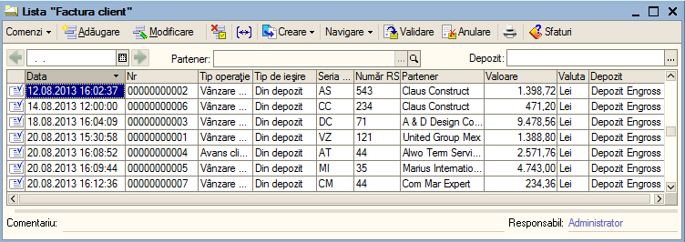
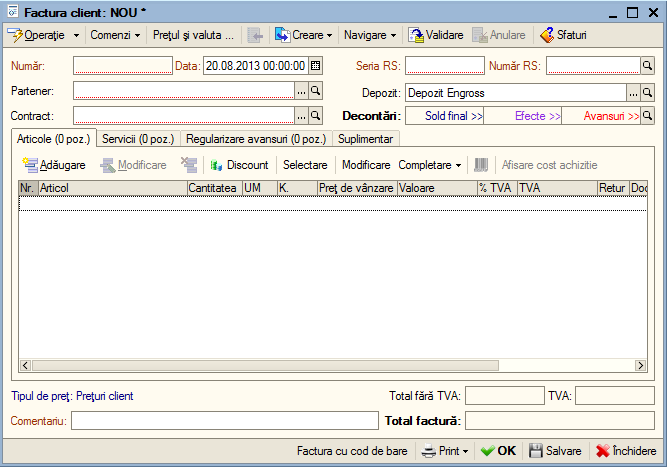
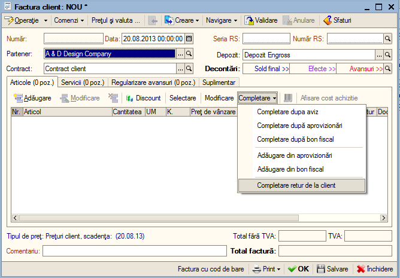
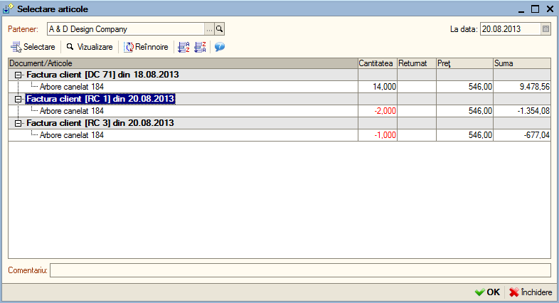
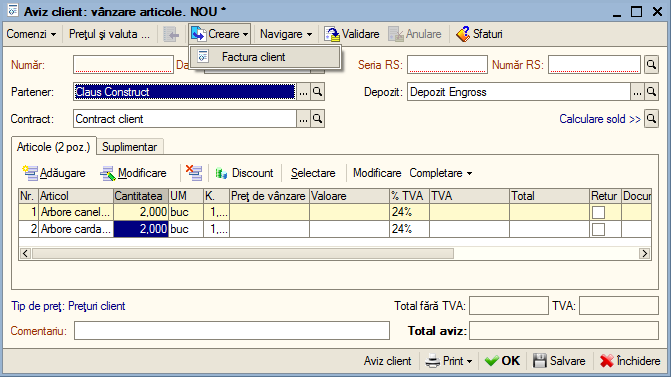

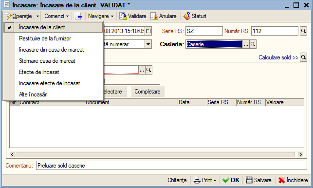
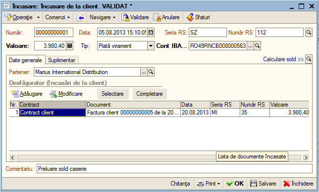
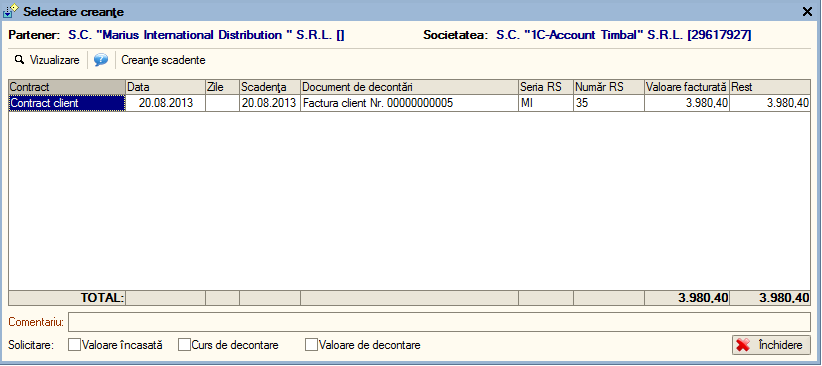
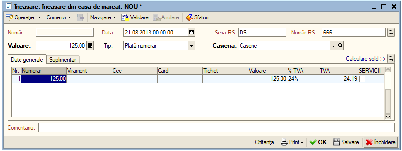
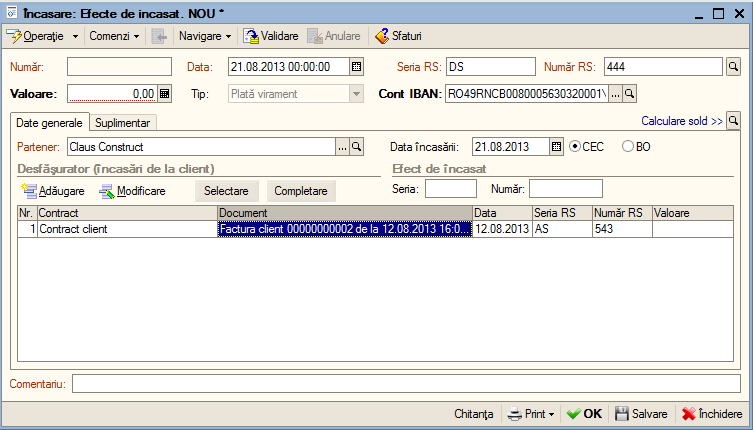
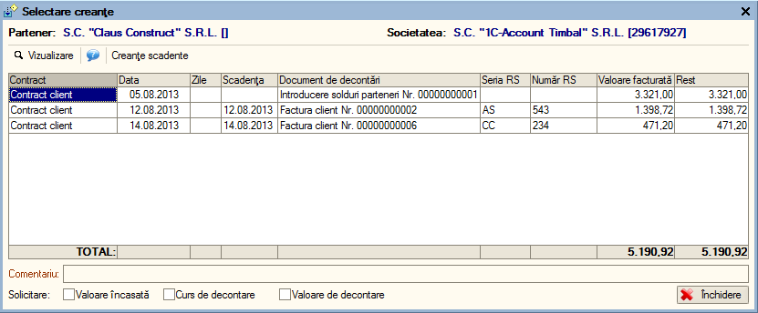
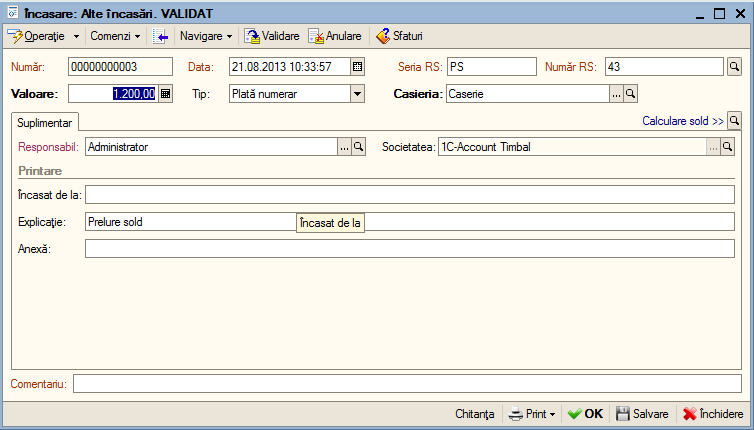
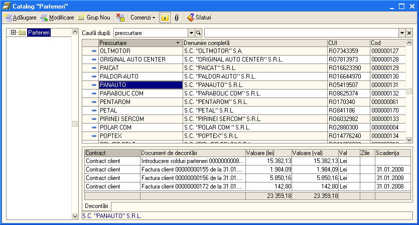
