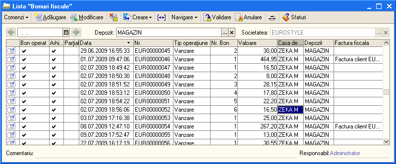

8. Operare în modulul "Amănunt"
===============================

Modulul şi opţiunile din meniul "**Amănunt**" sunt utilizate de firmele
care au activitate en-detail de desfacere către persoane fizice, şi
utilizează o casă de marcat fiscală.

Principalele opţiuni ale modulului sunt:

-  document "**Raport de vânzare cu amănunt**";

-  document "**Bon fiscal**";

-  procesare "**Închidere casa de marcat**";

-  procesare "**Interfaţă casier**";

-  procesare "**Retur articole vândute prin casa de marcat**";

-  document "**Schimbare preţuri cu amănunt**";

-  raport "**Raport de gestiune**";

-  flux de operaţii "**Facturare pe bază de bon fiscal**".

Cel mai important aspect al acestui modul reprezintă modul de legătură a
casei de marcat cu programul de gestiune integrat **1C:Retail** şi anume
pot fi următoarele situaţii:

-  **casa de marcat legată la calculator în regim on-line –** această
situaţie presupune operarea vânzărilor de produse direct din casa de
marcat cu deosebirea că preţurile vor fi preluate în mod automat din
baza de date. Prin urmare operatorul de la casa de marcat nu
introduce şi nu controlează direct preţurile ci îi va reveni sarcina
numai să citească codul de bare de pe produs cu ajutorul unui cititor
(sau să introducă un cod intern) şi la final să introducă cantitatea.
De asemenea acest regim permite conectarea mai multor case de marcat
la un singur calculator;

-  **casa de marcat legata la calculator in regim de imprimantă fiscală
–** în acest caz vânzările vor fi operate direct din calculator şi de
unde se va iniţializa comanda de listare a bonului fiscal la casa de
marcat. Astfel în program a fost creată o fereastră specială şi anume
punctual 7.4 "**Interfaţa casier**", unde operatorul cu ajutorului
unui cititor sau manual poate selecta produsele, să consulte
stocurile şi preţurile din toate gestiunile, să opereze o reducere de
preţ, să genereze în mod automat factura etc.;

-  **casa de marcat fără legătura fizică cu calculatorul –** dacă casa
de marcat nu este conectată direct la calculator atunci vânzările vor
fi operate manual în calculator fie ca valoare globală cu documentul
"**Încasare**" şi tip operaţie "**Încasare din casa de marcat**" sau
veţi introduce lista de produse manual în documentul "**Raportul de
vânzări cu amănunt**". În mod normal această legătură este utilizată
pentru o gestiune de tip global-valoric.

**8.1. Document "Raport de vânzări cu amănunt**"
------------------------------------------------

Documentul "**Raport de vânzări cu amănunt**" are ca scop centralizarea
vânzărilor atât a articolelor cât şi a serviciilor efectuate în cursul
unei zile la o casă de marcat. Vom analiza trei situaţii în funcţie de
modul de legătură a casei de marcat cu programul **1C:Retail.**

-  În prima situaţie vom presupune că casa de marcat este legată în
regim on-line cu programul în acest caz raportul de vânzări cu
amănunt va fi generat şi completat în mod automat. Pentru generare
veţi deschide procesarea "**Închidere casa de marcat**" unde veţi
specifica data, depozitul şi casa de marcat, apăsaţi "**OK**". La
finalizare programul va genera şi crea raportul de vânzări cu amănunt
şi va marca toate bonurile fiscale ca arhivate din ziua respectivă.

-  A doua situaţie când casa de marcat este conectată în regim de
imprimantă fiscală şi vânzările sunt operate prin intermediul
interfeţei casier. Raportul de vânzări cu amănunt este generat
asemănător cu prima situaţie şi anume cu procesarea "**Închidere casa
de marcat**".

-  A treia situaţie nu avem o legătură directă cu casa de marcat atunci
veţi completa documentul manual pe baza Z-ului zilnic emis de către
casa de marcat. Pentru a uşura introducerea datelor în acest caz am
realizat o procedură specială de preluare a vânzărilor dintr-un
fişier de tip Excel. Procedura respectivă poate fi accesată în fila
"**Articole**", meniu "**Import articole**", opţiunea "**Import
articole din Excel**".

|image94|

Pe lângă articolele vândute prin casa de marcat acest document mai
cuprinde lista serviciilor prestate (fila "**Servicii**") şi facturile
emise pe bază de bon fiscal (acestea vor fi evidenţiate în fila
"**Facturi**"). De asemenea, avem posibilitatea de vedea încasările
defalcate în funcţie de modalitatea de încasare prin numerar, virament,
CEC, card sau tichete de masă.

***Atenție!** Articolele care au fost facturate pe baza unui bon fiscal
nu trebuie să fie introduse fila "**Articole**" deoarece ele au fost
scăzute din gestiune pe bază de factură ci numai trebuie sa specificați
factura respectivă în filă.

Dacă doriţi ca documentul sa facă înregistrări în registru de casă
atunci veţi bifa opţiunea "**Înregistrare încasare**". Pentru formularul
de listare accesaţi Print şi din lista selectaţi formularul dorit.

8.2. Procesare "Bon fiscal"
---------------------------

Opţiunea "**Bon fiscal**" din cadrul acestui modul va deschide lista
bonurilor fiscale emise, iar la sfârşitul zilei ele vor fi
totalizate şi centralizate în raportul de vânzări cu amănuntul, aşa
cum am precizat mai sus. Odată ce aţi accesat opţiunea, programul va
afişa lista cu toate bonurile emise, unde vom putea vizualiza
următoarele:

-  **Bon operat** - dacă opţiunea este bifată atunci bonul respectiv a
fost operat cu succes pe casa de marcat;

-  **Arhivat** – bonul este marcat ca arhivat şi prin urmare bonul nu
face înregistrări în baza de date. Astfel el va fi păstrat numai
pentru a putea fi consultat ulterior şi pentru a putea opera un retur
de la client pe baza conţinutul lui în mod automat;

-  **Parţial** – bonul a fost trimis pentru listare dar n-a fost operat
pe casa de marcat;

-  **Data** – data când bonul a fost operat pe casa de marcat;

-  **Nr** – numărul intern al bonului fiscal;

-  **Tip operaţiune** – care poate fi vânzare, depunere numerar sau
extragere numerar din casierie;

-  **Nr. Bon** – numărul de înregistrare al bonului fiscal în ziua
respectivă;

-  **Valoare** – valoare bonului fiscal;

-  **Casa de marcat** – casa la care a fost operat bonul fiscal;

-  **Depozit** – gestiunea de unde au fost scăzute articolele;

-  **Factura fiscală** – factura fiscală emisă pe baza bonului fiscal.

|image95|

Pentru o mai bună vizualizare aveţi posibilitatea să filtraţi
această listă în funcţie de dată şi depozit. De exemplu pentru a
afişa toate bonurile emise într-o singură zi, apăsaţi la câmpul
respectiv iconiţa din stânga şi apoi selectaţi data dorită.

|image96|

Veţi observa ca programul va afişa numai bonurile din ziua respectivă şi
la câmpul data va apărea o iconiţă nouă ce va permite să anulaţi
filtrarea. În mod asemănător puteţi filtra lista pentru un depozit
numai.

8.3. Procesare "Închidere casă de marcat"
-----------------------------------------

Această opţiune se accesează la sfârşitul zilei, pentru a se genera şi
completa automat raportul zilnic de vânzări cu amănuntul. Această
procesare se va utiliza numai în cazurile când programul are legătură cu
casa de marcat şi anume în regim on-line sau imprimantă fiscală.

**Dacă nu aveţi casa de marcat fiscală legată la program**, nu veţi
accesa această procesare şi veţi completa manual raportul de vânzări cu
amănunt, pe baza raportului Z emis de casa de marcat (punctul 7.1
Document "**Raport de vânzări cu amănunt**").

Înainte de a închide casa de marcat din calculator pentru început veţi
genera raportul zilnic de vânzări din casa de marcat propriu-zisă
(raportul Z). După ce veţi face acest lucru din meniul principal, se
acţionează secţiunea "**Amănunt**", opţiunea "**Închidere casa de
marcat**". Apoi se deschide fereastra cu aceeași denumire, în care veţi
verifica informaţiile din câmpurile respective: data curentă, casa de
marcat şi depozitul.

|image97|

În cazul în care unul din câmpuri nu este completat, veţi apăsa
"**...**" şi veţi selecta din lista informaţiile necesare. Apoi veţi
acţiona butonul "**OK**". În continuare programul va genera automat
documentul "**Raport de vânzări cu amănunt**" în care veţi verifica dacă
sunt completate casieria în câmpul cu acelaşi nume, iar în partea
inferioară a documentului dacă suma de la ''**Total general''** coincide
cu suma din câmpul ''**Numerar**''. Apoi veţi valida documentul cu
ajutorul butonului "**Validare**" din bara superioară sau "**OK**" din
bara de comenzi inferioară **.**

***Atenție!** Dacă există bonuri fiscale nevalidate , atunci la
închiderea casei de marcat va apărea mesaj in acest sens. Pentru aceasta
vă recomandăm să verificați toate bonurile fiscal emis in cursul zilei
sa fie validate (**Amănunt → Bon fiscal**).

După validarea raportului zilnic de vânzări, puteţi închide fereastra
"**Închidere casa de marcat**" cu ajutorul butonului cu acelaşi nume
"**Închidere**".

8.4. Procesare "Interfaţă casier"
---------------------------------

Procesarea "**Interfaţa casier**" va fi utilizată în cazul în care casa
de marcat este legată la program **numai în regim de imprimantă
fiscală**, prin urmare vânzările sunt operate direct din calculator şi
apoi se accesează comanda de listare a bonului fiscal la casa de marcat.
Înainte de a utiliza această interfaţă trebuie să vă asiguraţi că casa
de marcat este conectată la calculator şi s-au făcut toate setările
corespunzătoare în program. În mod normal pe lângă casa de marcat şi
programul de gestiune se mai utilizată o aplicaţie de comunicaţie
(driver). Această aplicaţie diferă de la o casă de marcat la alta.
Pentru conectare şi configurarea setărilor veţi lua legătura cu unul din
specialiştii **1C Romania**.

După ce aţi conectat casa de marcat şi s-au făcut toate setările
necesare vă recomandăm adăugător pentru utilizatorul care va opera
vânzările să setaţi pentru el utilizarea interfeţei casier în mod
implicit. Această setare va permite ca odată cu lansarea programului
interfaţa să se deschidă automat pentru utilizatorul respectiv.Dacă
interfaţa casier n-a fost deschisă în mod automat atunci o veţi accesa
din modulul"**Amănunt**", opţiunea "**Interfaţa casier**", apoi va
apărea fereastra în care programul va propune numărul bonului fiscal,
implicit numerotarea bonurilor fiscale începe în fiecare zi cu primul
număr, iar dumneavoastră veţi confirma cu "**OK**".

|image98|

Acum se deschide interfaţa de lucru propriu-zisă, în continuare veţi
adăuga produsele după care veţi da comanda "**Închidere bon**".

|image99|

Adăugare articolelor se poate efectua prin mai multe modalităţi vom
încerca să enumerăm pe cele mai principale:

-  **Automat prin cod de bare** – în această situaţie trebuie să aveţi
un cititor coduri de bare conectat la calculator şi în program să fie
setat evidenţa codurilor de bare pentru articole. În acest caz veţi
citi codul de bare de pe articol propriu-zis ca rezultat programul va
adăuga automat un rând nou reprezentând articolul respectiv. Odată cu
introducerea articolului va fi preluat preţul de vânzare in program,
casierul va specifica doar cantitatea dacă aceasta este mai mare de
1.

-  **Manual prin cod de bare** – această modalitate presupune să apăsaţi
butonul din dreapta interfeţei casier (cu imaginea unui cod de bare)
şi în fereastra apărută să introduceţi manual codul de bare. În
continuare ca şi la prima situaţia programul va adăuga articolul
respectiv tot cu preţul de vânzare şi cantitatea implicită 1.

-  **Manual prin adăugarea unui rând nou –** în acest caz veţi poziţiona
mausul pe tabel: apăsaţi tasta "**Insert**" sau butonul de dreapta
maus şi selectaţi opţiunea "**Adăugare**". Programul va adăuga un
rând nou, apoi vă puteți poziţiona la una din coloane, astfel: la
coloana "**Cod Articol**" veţi introduce codul şi "**Enter**", la
coloana "**Cod de bare**" veţi introduce manual codul de bare,
tastați "**Enter**" sau la coloana "**Articol**" veţi introduce
denumirea articolului şi din nou apăsați tasta "**Enter**".

În momentul în care veți utiliza unul din modalitățile de mai sus
rezultatul va fi unul și același și anume programul va introduce în
interfață un rând nou și va completa automat prețul de vânzare,
cantitatea egală cu 1, unitatea de măsură și valoarea. Dacă s-au
vândut mai multe produse atunci veți proceda la fel și pentru
celelalte articole din bonul fiscal, iar la sfârșit veți acționa
opțiunea "**Închidere bon**" sau combinația "**Ctrl + Enter**", în
continuare va trebui să specificați modalitatea de încasare o
bonului respectiv. Prin urmare în fereastra deschisă "**Încasare bon
fiscal**" va fi afișat totalul de încasat și apoi o listă de câmpuri
pentru fiecare modalitate de încasare în parte și anume: Numerar
primit, CEC, Virament, Card bancar, Tichete de masă. Veți introduce
valorile în câmpurile dorite.

Pentru finalizare veți confirma cu butonul "**OK**". Odată ce veți
confirma încasarea bonului programul automat va scoate bonul de
marcat la casa de marcat. După listarea bonului fiscal cu succes va
afișată din nou interfața casier unde deja va fi afișat următorul
număr pentru bonul fiscal și lista va fi golită. Ca urmare puteți
opera următorul bon fiscal.

|image100|

***Atenție!** Vă recomandăm înainte de a apăsa butonul "**OK**" în
fereastra"**Încasare bon fiscal**" să confirmați suma încasată de la
client, deoarece la această etapă aveți posibilitatea de a modifica sau
chiar anula bonul fiscal. Odată ce ați confirmat încasarea bonului
respectivul document va fi înregistrat în sistem și anularea lui se va
face deja printr-un proces verbal.

8.5. Procesare "Retur articole vândute prin casa de marcat"
-----------------------------------------------------------

Pentru a opera un retur de marfă vândută prin casa de marcat trebuie
să identificați bonul fiscal pe baza căruia a plecat marfa
respectivă. În mod normal clientul pe lângă produsele returnate
trebuie să prezinte bonul fiscal (dovada achiziționării produselor).

Pentru identificarea și găsirea mai rapidă a bonului respectiv vom
utiliza procesarea "**Retur articole vândute prin casa de marcat**".
Pentru accesare veți intra în meniu "**Amănunt**" de unde veți
selecta opțiunea retur marfă. Prin urmare cu ajutorul acestei
procesări noi vom găsi bonul fiscal dorit și pe baza datelor lui se
va genera automat factura de retur.

În fereastra deschisă vom căuta bonul fiscal: pentru aceasta în
câmpul "**Număr**" veți introduce numărul bonului și apoi data
bonului. După introducerea acestor date programul automat va găsi
bonul fiscal și va completa restul câmpurilor din procesare. După
care veți edita lista de articole în așa fel ca tabelul să cuprindă
numai produsele returnate.

|image101|

Deoarece baza returului va constitui generarea unei facturi fiscale
în minus trebuie să completați datele clientului. Odată ce ați
completat și câmpurile privind datele clientului pentru finalizare
veți apăsa "**Creare documente**".

|image102|

Odată ce factura fiscală va fi emisă nu rămâne decât să validați
documentul și să listați factura propriu-zisă.

8.6. Document "Schimbare preţuri articole"
------------------------------------------

Documentul "**Schimbare prețuri cu amănunt**" este foarte important
pentru activitatea de amănunt cu evidență cantitativ-valorică, așa
încât un articol să existe în stoc la un singur preț. **1C:Retail**
face automat această schimbare de preț, atât în momentul
aprovizionării cât și în momentul vânzării. Programul va urmări la
fiecare etapă de operare dacă prețul de vânzare cu amănuntul pentru
un articol a fost modificat și imediat va propune să generați
automat o schimbare de preț. Pe baza documentelor de schimbare
prețuri cu amănunt aveți posibilitatea să listați procesul verbal de
modificare de preț.

8.7. Raport "Raport de gestiune"
--------------------------------

Tot din modulul "**Amănunt**" aveți posibilitatea să generați în mod
automat un "**Raport de gestiune**". Acesta poate fi listat zilnic
sau pe o anumită perioadă pentru fiecare depozit sau gestiune în
parte. Pentru a accesa documentul pe baza căruia a fost întocmit
raportul de gestiune trebuie să faceți dublu click și acesta va fi
afișat, iar dacă se constată o greșeală, atunci aceasta poate fi
corectată, și raportul de gestiune să fie creat din nou.

8.8. Flux de operaţii "Facturare pe bază de bon fiscal"
-------------------------------------------------------

Programul permite pe baza unui bon fiscal emis să generați automat o
factură client. Factura fiscală odată generată va prelua automat toate
produsele din bon și pentru finalizare veți specifica numai datele de
facturare ale clientului. Pentru generarea facturii veți deschide lista
de facturi din meniu "**Vânzări**" opțiunea "**Factura client**". În
continuare veți apăsa butonul "**Adăugare**" sau combinația "**Alt-A**".
Pe ecran va fi afișată o factură client nouă.

|image103|

În documentul deschis accesați meniu "**Completare**" și apoi opțiunea
"**Completare după bon fiscal**", ca rezultat va fi afișată lista de
bonuri fiscale emise în ziua respectivă.

|image104|

Din lista de bonuri fiscale veți selecta bonul dorit. Ca finalitate
programul va prelua toate produsele din bon respectiv.

|image105|

Apoi veți specifica datele clientului (partenerul) în rest pe baza
setărilor din program vor fi completate următoarele câmpuri: seria,
numărul și depozitul. Pentru finalizare veți apăsa butonul "**OK**"
după care programul va solicita să salvați (confirmând operația cu
"**Da**") și în plus veți observa că programul a completat la fila
"**Suplimentar**" tipul de încasare și numărul bonului fiscal.

