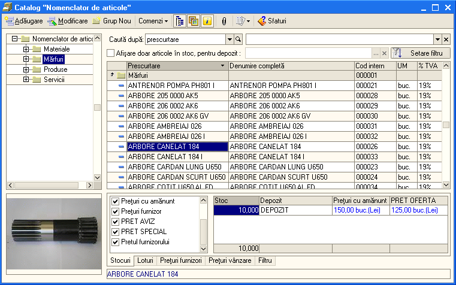
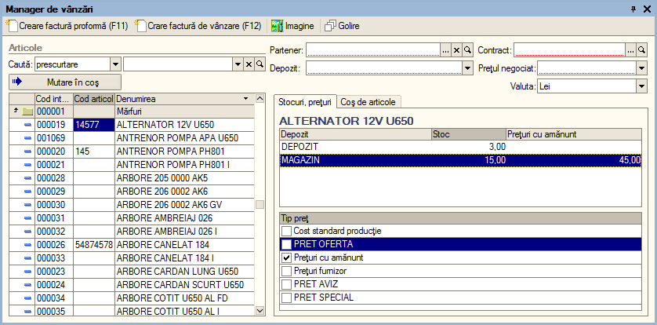
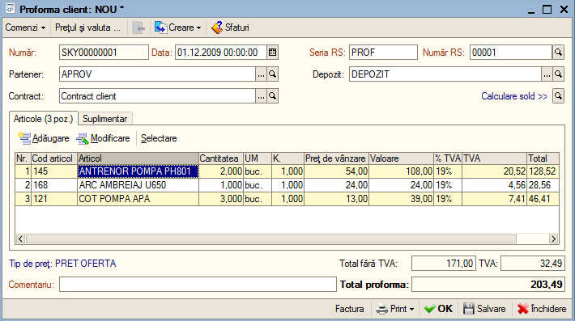
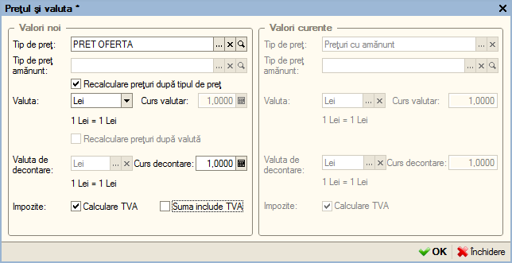
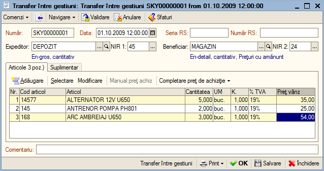
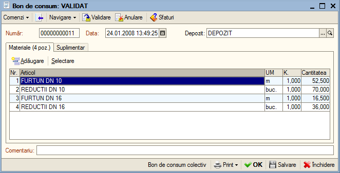
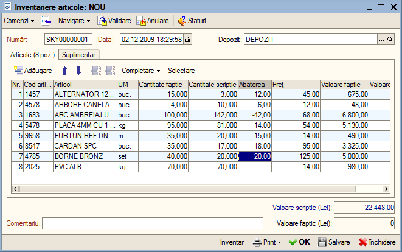
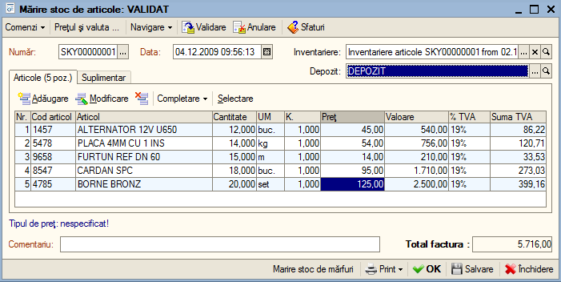
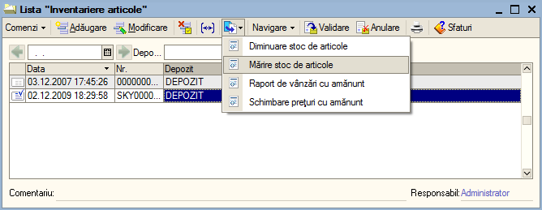

9. Operare în modulul "Stocuri"
===============================

***Atenție!** În cazul în care doriți să creați o factură pe baza nu
doar a unui bon fiscal ci două sau mai multe, atunci veți utiliza o altă
opțiune și anume "Adăugare din bon fiscal" din meniul completare
acționați comanda și selectați primul bon fiscal ,apoi din nou veți
accesa această comandă pentru a selecta cel de al doilea bon și veți
continua până veți selecta pe rând toate bonurile.

Modulul şi opţiunile din meniul "**Amănunt**" sunt utilizate de
firmele care au activitate en-detail de desfacere către persoane
fizice, şi utilizează o casă de marcat fiscală.

Principalele opţiuni ale modulului sunt:

-  catalog "**Nomenclator de articole"**

-  procesare "**Manager de vânzări**"

-  document "**Factura proforma**";

-  document "**Transfer între gestiuni**"

-  document "**Bon de consum**"

-  catalog "**Depozite**"

-  document "**Inventariere articole**"

-  document "**Mărire stoc de articole**"

-  document "**Diminuare stoc de articole**"

-  raport "**Mișcare articole**"

-  raport "**Profit brut**"

-  raport "**Fișa de magazie**"

9.1. Catalog "Nomenclator de articole"
--------------------------------------

Catalogul "**Nomenclator de articole**" este destinat pentru crearea
articolelor şi ataşării acestora a diverselor atribute,
caracteristici, descriere detaliată precum şi imagini.

|image106|

După cum observaţi din imaginea de mai sus **1C:Retail** permite
structurarea nomenclatorului de articole în grupuri şi subgrupuri în
funcţie de nevoile dumneavoastră. Astfel aveţi posibilitatea de a
vizualiza nomenclatorul de articole atât ca structura arborescentă
(stânga), dar şi ca listă pe fiecare grup sau subgrup în parte ajungând
până la nivel de articol.

Pentru fiecare articol pot fi vizualizate rapid informaţii foarte utile
precum: stocul existent, depozitul unde se află, preţurile actuale pe
fiecare depozit şi loturile neînchise. Informaţiile afişate pot fi
filtrate (de exemplu pot fi afişate numai articolele dintr-un anumit
depozit).

Pentru o identificare uşoară de către vânzător a articolelor uşor
confundabile acestea pot fi asociate cu imagini, aşa încât în momentul
vânzării ele pot fii uşor identificate de către utilizator. În afară de
denumire, suplimentar puteţi utiliza codul articol şi/sau un număr
nelimitat de coduri de bare, pentru identificare articolelor.

În catalogul de articole, se pot adăuga noi articole, se pot modifica
cele existente deja sau se pot marca pentru ștergere articolele ce nu se
vor mai utiliza.

***Atenție!** Articolele marcate pentru ștergere, înainte de a fi
șterse definitiv vor fi verificate dacă au fost utilizate în documente.
În cazul în care va exista cel puțin o mișcare pe element (utilizată
într-un document) atunci articolele respective nu vor putea fi șterse.

Pentru crearea unui nomenclator de articole, consultați punctul 4.3
catalogul "**Creare nomenclator de articole**".

9.2. Procesare "Manager de vânzări"
-----------------------------------

Procesarea "**Manager de vânzări**" permite să consultați rapid
informațiile despre articole și anume caracteristicile lor,
stocurile, lista de prețuri etc. Această procesare a fost concepută
pentru a fi utilizată de către managerii de vânzări așa cum
sugerează și denumirea ei. Suplimentar pe lângă informațiile utile,
un manager poate să facă un calcul preliminar pentru articolele
dorite de un client potențial creând un coș de articole. Crearea
unui coș de articol va permite ușor să adăugați, modificați lista de
produse în funcție de solicitările clientului fără a mai fi cazul să
creați o factură proforma sau o factură client în acest sens.
Totodată pe baza acestui coș de articol pentru ușurarea muncii aveți
posibilitatea să generați imediat o factură proforma sau direct o
factură client.

Pentru accesarea acestei proceduri veți accesa meniu "**Stocuri**"
și apoi opțiunea "**Manager de vânzări**".

|image107|

În partea stânga, va fi afișat tot nomenclatorul de articole, de
unde veți putea selecta produsele dorite. În continuare acționați
click pe produsul dorit, imediat se vor afișa informațiile despre
produsul respectiv, cum ar fi lista de depozite, stocurile pentru
fiecare depozit în parte, prețurile în funcție de fiecare tip de
prețuri definit și apoi aveți posibilitatea să mutați produsul în
coș cu butonul "**Mutare în coș**". În acel moment, veți observa, în
fila "**Coș de articole**", că a fost adăugată o poziție nouă cu
produsul selectat puțin mai devreme. La fel veți proceda și pentru
adăugarea în coșul de articole a altor produse.

Când ați adăugat în coșul de articole toate produsele dorite, veți
observa în partea inferioară a ferestrei o valoare totală a acestor
produse. În acest moment, opțiunile pe care le aveți sunt
următoarele: crearea unei facturi proforma, crearea unei facturi
client sau renunțarea la acestea și golirea coșului de articole.

Dacă doriți să generați o factură proforma, tot ce trebuie să faceți
este să apăsați butonul "**Creare factura proforma**" sau să tastați
"**F11**". Imediat, va fi generată o factură proforma nouă, pe care
o puteți deja valida și lista. În cazul în care doriți să faceți o
factură client, veți apăsa butonul "**Creare factura client**" sau
tastați "**F12**". Astfel, se va genera automat factura client, în
care veți regăsi toate datele completate.

În partea dreaptă a ferestrei deschise aveți posibilitatea să
specificați mai multe filtre: cum ar fi clientul (dacă este vorba
deja despre un client al companiei dumneavoastră), apoi depozitul de
unde doriți să fie scăzute produsele și lista de prețuri negociate
cu clientul respectiv. În continuare puteți bifa ce tipuri de
prețuri doriți să fie afișate în dreptul produselor ce le veți
selecta din nomenclatorul de articole.

Dacă, din diverse motive, doriți să renunțați la produsele din coșul
de articole, acționați butonul "**Golire**", astfel vor fi șterse
automat toate produsele și puteți relua adăugarea altor produse în
coșul de articole sau închiderea procesării "**Manager de
vânzări**".

9.3. Document "Factura proforma client"
---------------------------------------

Factura proforma reprezintă un document emis către un client
potențial unde sunt specificate lista de produse ce vor fi vândute,
detaliate pe cantități și prețuri. Acest document nu face
înregistrări în evidența noastră ci servește ca o "dovadă" pentru o
plată prin virament.

Pentru a adăuga o factură proforma în program, aveți două opțiuni:

-  primă opțiune este utilizarea procesării "**Manager de vânzări**",
cum am explicat la capitolul anterior;

-  a doua opțiune fiind accesarea directă a opțiunii "**Factura
proforma**" din meniul "**Stocuri**" și adăugarea unui document nou
în lista de facturi proforma, prin acționarea butonului
"**Adăugare**" sau utilizarea combinației de taste "**Alt-A**".

În continuare vom detalia a doua opțiune şi anume adăugare unei
facturi proforma în mod manual. Cum am explicat puțin mai sus,
pentru adăugarea unei facturi proforma, veți accesa meniul
"**Stocuri**" și apoi opțiunea "**Factura proforma**". Astfel, se va
deschide lista "Facturi proforma", în care veţi accesa butonul
"**Adăugare**" sau bine-cunoscuta combinaţie de taste "**Alt-A**"
pentru a adăuga un document nou în listă.

|image108|

Odată deschis documentul "**Proforma client: Nou**", se va proceda la
completarea datelor necesare unei facturi. Astfel, în antetul
documentului veţi completa data documentului, seria şi numărul facturii
(daca nu s-au făcut setări pentru generarea lor automată) şi apoi
selectaţi din catalogul de parteneri denumirea clientului, după care
contractul va fi automat preluat.

Acum, puteţi trece la adăugarea articolelor. Astfel, veţi acţiona
butonul "**Adăugare**" şi veţi alege produsul, specifica cantitatea şi
preţul de vânzare. Dacă doriţi ca programul să preia automat preţurile
pe baza unor liste de preţuri definite deja, atunci vă recomandăm să
accesaţi butonul "**Preţul şi valuta**" şi în fereastra apărută să
specificaţi lista de preţuri dorită.

|image109|

După ce aţi completat toate articolele şi informaţiile necesare,
veţi proceda la salvarea documentului şi la listarea formularului de
listare.

* **Atenție!** Completarea datelor din factura proforma sunt
asemănătoare cu cele din documentul Factura client , explicate la
punctul 7.1 Document "**Factura client**."

9.4. Document "Transfer între gestiuni"
---------------------------------------

Pentru început, acţionaţi din meniul "**Stocuri**", opţiunea
"**Transfer între gestiuni**", ca urmare se va deschide lista cu
toate transferurile operate. Acest document este utilizat pentru
transferul mărfurilor dintr-o gestiune în altă. În cadrul listei
pentru a introduce un document nou, veți apăsa butonul
"**Adăugare**" sau tastați combinația "**Alt-A**" și astfel se va
deschide documentul "**Transfer între gestiuni: Nou**".

În cadrul documentului, veți completa data, seria și numărul va fi
generat în funcție de depozitul expeditor, apoi veți selecta
depozitul destinatar și veți completa lista cu articolele
transferate. Fila "**Suplimentar**" permite să selectați gestionarii
pentru fiecare depozit în parte.

|image110|

După ce ați introdus toate informațiile inclusiv cele suplimentare,
documentul poate fi validat cu ajutorul butonului "**Validare**" sau
combinația "**Ctrl + Enter**" și se va putea lista nota de transfer.
Pentru un transfer dintr-o gestiune en-gros în una en-detail, se pot
lista și notele de recepție pentru depozitul expeditor, respectiv
destinatar, sau avizul de expediție între cele două depozite.

9.5. Document "Bon de consum"
-----------------------------

Prin intermediul documentului "**Bon de consum**", se pot înregistra
consumurile de materiale sau materii prime, după caz. Pentru a
deschide lista de documente, accesați meniu "**Stocuri**", apoi
opțiunea "**Bon de consum**".

|image111|

La crearea unui bon de consum veți completa data documentului, veți
selecta depozitul de unde se vor consuma articolele.

***Atenție!** Neapărat trebuie să specificați un depozit de tip
en-gros deoarece consumul unui articol presupune în mod obligatoriu
o evidență cantitativă.

9.6. Catalog "Depozite"
-----------------------

Acest catalog va conține lista de gestiuni de tip depozite,
magazine, şantiere de lucru pentru construcţii, materiale trimise
spre prelucrare la terţi, etc. Pentru adăugare, modificarea
setărilor sau ștergere unui depozit consultați punctul 4.2 "**Lista
de depozite**".

***Atenție!** Dacă ați utilizat depozitul cel puțin într-o
înregistrare nu mai puteți să-l ștergeți sau modifica setările lui
principale.

9.7. Document "Inventariere articole"
-------------------------------------

Documentul "**Inventariere articole**" vă permite să înregistraţi
rezultatul unei inventarieri efectuate de către societatea
dumneavoastră. Această inventariere poate fi efectuată nu numai
pentru o gestiune de tip en-gros ci și una de tip amănunt
(en-detail). În mod normal documentul de inventariere poate fi
utilizat pentru verificarea stocului ori de câte ori este cazul. De
asemenea acest document permite pe baza lui să regularizați stocul
de articole în depozitul dorit.

|image112|

Se poate observa că grila conţine mai multe coloane în comparaţie cu
celelalte tipuri de documente. Aceasta se datorează faptului că în
grilă se introduc nu doar datele faptice ci şi cele scriptice
(rezultate din evidenţă). Astfel rezultatele faptice ale
inventarierii vor fi automat comparate cu datele scriptice,
ajustările cantitative şi valorice efectuându-se în consecinţă.

După cum ştiţi butonul "**Completare**" conţine o listă de comenzi
care permite completarea automată a grilei cu diverse date din
evidenţă. În cazul nostru grila poate fi completată conform cu
stocul scriptic rezultat la data documentului introdus şi pentru
depozitul specificat.

Deşi documentul de inventariere nu face înregistrări directe în
program, în continuare veți avea posibilitatea, în funcție de
rezultatele obţinute la inventariere să introduceți automat
documentele subordonate: "**Mărire stoc de articole**" şi
"**Diminuare stoc de articole**". Conţinutul acestor documente vor
fi completate automat în funcţie de rezultatele inventarului, prin
urmare grila din documentul "**Mărire stoc de articole**" va conţine
doar cantitatea în plus a articolelor, pe când în grila din
documentul "**Diminuare stoc de articole**" vor fi trecute acele
poziţii ale articolelor, care trebuie scăzute pe baza inventarului
efectuat. După validarea acestor documente, cantitatea articolelor
în depozite va fi egală cu cea faptică.

9.8. Document "Mărire stoc de articole"
---------------------------------------

Pentru a consemna plusurile de inventar trebuie să utilizați
documentul "**Mărire stoc de articole**". De asemenea acest document
poate fi folosit pentru introducerea stocului inițial de articole.

Pentru introducerea plusului de inventar veți crea un document nou
și in cadrul documentului de mărire a stocului de articole, veți
completa data documentului, selecta documentul de inventariere și
depozitul pentru care se înregistrează plusul de inventar. Pentru
preluarea datelor veți accesa meniu "**Completare**", opțiunea
"**Completare conform inventar**" și astfel veți observa că în grilă
au fost adăugate articolele pentru care s-au constat plusuri la
inventar. Acum veți valida documentul și în caz de necesitate puteți
să listați formularul de listare.

|image113|

A doua variantă de introducere mărire stoc de articole presupune să
creați automat pe baza documentului de inventariere mărirea de stoc.
Pentru aceasta veți accesa lista de documente inventar și să
selectați document dorit și apoi să accesați comanda "**Creare pe
baza**" și din lista de opțiuni veți selecta "**Mărire stoc de
articole**".

|image114|

Ca rezultat vor fi preluate toate articolele în plus și va generat
automat documentul de mărire → documentul va fi automat validat și dacă
doriți puteți lista formularul de listare.

9.9. Document "Diminuare stoc de articole"
------------------------------------------

Pentru a consemna minusurile de inventar veți utiliza documentul
"**Diminuare stoc de articole**". Crearea acestui document urmează
aceeași procedura cu documentul punctul 9.8 "**Mărire stoc de
articole**".

